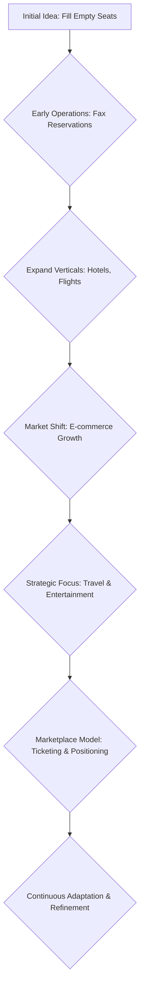

# Atrápalo

> Atrápalo stayed a multi-vertical leisure marketplace — tickets, travel, restaurants — by chasing demand signals instead of locking into one niche (they literally started selling tickets by fax).

- Stage: growth
- Practices: ai_product, discovery, delivery, growth

## Manuel Roca

### Operating loop

### Ownership

- **Discovery:** Supported by user demand and market signals, with a willingness to pivot and focus.
- **Prioritization:** Driven by identifying verticals with empty capacity and adapting to evolving e-commerce capabilities.
- **Shipping:** Evolved from manual processes to integrated ticketing systems and marketplace features.
- **Sales-input:** Integrated through user feedback and observing market trends, leading to expansion into new verticals.
- **Design:** Focused on creating a good user experience, initially by removing payment friction and later by developing robust ticketing and marketplace platforms.

### Evidence

- *Initially, it wasn't ticketing; it was reservation lists that we passed physically with a fax.*
- *We were one of the pioneers in offering a service via the internet.*

[Source](../episodes/empezamos-vendiendo-entradas-por-fax-manuel-roca-ceo-y-cofounder-de-at-svhwRR8y1zA.md)
