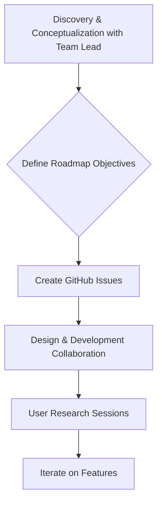

# Automattic

> At Automattic (Jetpack), product designers often own discovery and prioritization themselves — design absorbs classic PM duties under high autonomy.

- Stage: scale
- Practices: discovery, delivery, org_shape, roles

## Cris Busquets

### Operating loop

### Ownership

- **Discovery:** Primarily owned by the Product Designer, with significant input from the team lead.
- **Prioritization:** Influenced by business-side roadmaps and team leads, with product leads having a guiding role.
- **Shipping:** Teams work on their respective roadmaps, with a philosophy of releasing features that are incrementally better than existing solutions.
- **Sales Input:** Not explicitly mentioned.
- **Design:** Owned by the Product Designer, with close collaboration with the development team.

### Evidence

- *The philosophy is that each team works as best it can; there's no philosophy of imposing a structure like we're going to work with Ship Up, we're going to work with Scrum.*
- *I probably do more of the Discovery part because I conceptualize a lot with Mikael, who is the lead of Zap, about the current state of the functionalities we have.*

[Source](../episodes/el-rol-del-product-designer-con-cris-busquets-senior-product-designer--wLA8F22fkZw.md)
