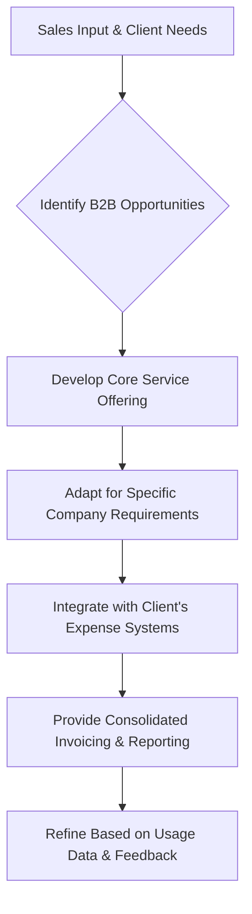

# Cabify

> Cabify product balances two-sided marketplace liquidity: rider experience and driver supply are one system — local market ops and product ship together.

- Stage: scale
- Practices: enterprise, discovery, delivery, roles

## Eloi Pardo

### Operating loop

- The core operating loop for Cabify's marketplace product involves:
- 1.  **Demand Generation:** Attracting passengers needing rides.
- 2.  **Supply Management:** Ensuring sufficient drivers are available.
- 3.  **Pricing Adjustment:** Dynamically setting prices based on demand and supply to incentivize both sides.
- 4.  **Matching Algorithm:** Optimizing the assignment of drivers to passengers based on proximity, route efficiency, and user/driver history.
- 5.  **Governance Enforcement:** Implementing rules and features to ensure good practices, safety, and trust for both users and drivers.
- 6.  **Transaction Maximization:** Aiming to increase the number of completed rides and overall revenue.

### Ownership

- **Discovery:** Primarily driven by user research, data analysis, and feedback from drivers and riders, with a dedicated user research team facilitating these efforts.
- **Prioritization:** Decisions are influenced by business objectives, revenue goals, and the need to balance the needs of both passengers and drivers.
- **Shipping:** The product and engineering teams work collaboratively, with a strong emphasis on data-driven decisions.
- **Sales Input:** B2B operations have specific product considerations, managed by a dedicated B2B product area.
- **Design:** While not explicitly detailed, the emphasis on a "design-driven" approach in past experiences suggests a strong role for design in product development.

### Evidence

- *We have models of pricing, models that we call of matcher, assignments, and models of governance.*
- *The main need is to move from point A to point B, and many times the user doesn't care which application it is, as long as the price is acceptable and the pickup time is reasonable.*

[Source](../episodes/como-hacer-producto-en-un-marketplace-eloi-pardo-head-of-product-en-ca-6Kp7vOnuG9s.md)

## Ramón Andrío

### Operating loop

### Ownership

- **Discovery:** Primarily driven by sales teams who are closest to client needs and market opportunities. Product teams collaborate with sales to understand these needs and translate them into service offerings.
- **Prioritization:** Influenced by sales input regarding revenue potential and ease of sale, alongside product team analysis of market trends and technological feasibility.
- **Shipping:** Involves adapting the core service for specific client requirements and ensuring seamless integration with their systems.
- **Sales Input:** Crucial for identifying opportunities and shaping the product roadmap.
- **Design:** Focuses on creating a user-friendly platform for businesses, including features for expense control and reporting.

### Evidence

- *Cabify's configuration for businesses generates a full invoice for the entire trip, whereas Uber's configuration invoices only its commission.*
- *The company aims to provide predictable pricing and comprehensive reporting, which is a significant advantage for businesses managing expenses.*

[Source](../episodes/las-claves-para-ser-product-manager-con-ramon-andrio-head-of-product-d-CnxPjb9Ha-k.md)
