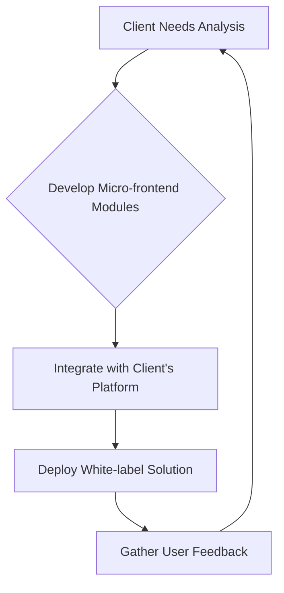

# Clevergy

> Clevergy sells white-label energy SaaS to utilities and solar installers — product deepens their customer relationships instead of competing for end users.

- Stage: growth
- Practices: discovery, delivery, roles, growth

## Álvaro Pérez

### Operating loop

### Ownership

- **Discovery:** Product team, driven by client feedback and market analysis.
- **Prioritization:** Co-founders (Product, CTO, Sales) collaborate on roadmap decisions.
- **Shipping:** Product and Engineering teams manage the development and deployment lifecycle.
- **Sales Input:** Sales team provides direct market feedback and client requirements.
- **Design:** Product and UX designers work on user interface and experience, ensuring brand consistency for clients.

### Evidence

- *We sell a white-label application with their brand and look and feel to give to their clients.*
- *The value proposition is brutal for improving time to market; the micro-frontend plugs into their application.*

[Source](../episodes/de-consultoria-industrial-a-product-management-con-alvaro-perez-founde-6ctQIvhwj2g.md)
