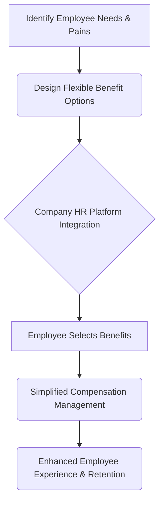

# Cobee

> Cobee wins B2B2C by making employees want Cobee benefits — HR buys the platform, but product prioritizes employee-side value so retention pulls adoption.

- Stage: growth
- Practices: growth, enterprise, leadership, roles

## Virginia Diego

### Operating loop

### Ownership

- Discovery: Product team, HR users, employees
- Prioritization: Product team, informed by user feedback and business goals
- Shipping: Product team
- Sales Input: Sales team, HR stakeholders
- Design: Design team, integrated within product squads

### Evidence

- *The strategy of product is to identify the problems I need to solve, not to identify what features I'm going to release.*
- *The focus is precisely that: to be the option that you as an employee want your compensation to be with Cobee because you see the value.*

[Source](../episodes/product-leaders-5-producto-en-negocios-b2b2c-con-virginia-diego-head-o-cEH9WEn-Z9o.md)
