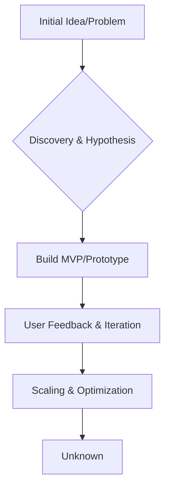
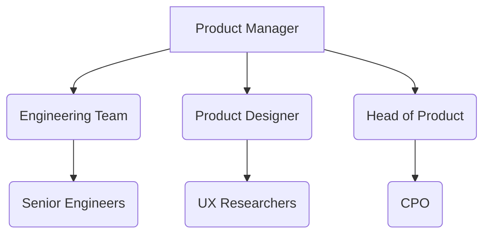
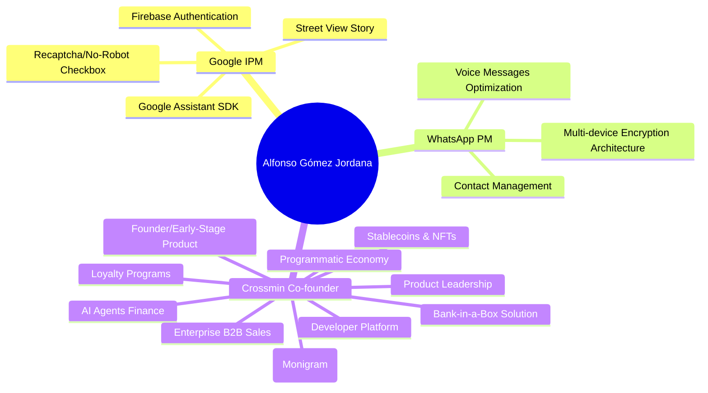

# Crossmin

- Stage: early
- Practices: enterprise, ai_product, discovery, delivery, roles
- Episodes: 1

## Guests

- Alfonso Gómez Jordana — Co-founder ([episode](../episodes/de-crear-el-no-soy-un-robot-en-google-a-montar-mi-startup-MDwT_3SAhDk.md))

## Alfonso Gómez Jordana

Alfonso Gómez Jordana, co-founder of Crossmin, discusses his journey from product management roles at Google and WhatsApp to building a developer platform for the programmatic economy. The conversation highlights the evolution of product development, the intricacies of AI integration, and the future of financial transactions.

### Product workflow

### Roles & org

### Practice map

### Key moves

- **Learn by Doing:** Practical experience, even in internships, is crucial for product development.
- **Focus on Core Value:** At WhatsApp, the emphasis was on features that strengthened the network and user growth, often requiring saying no to other ideas.
- **Developer Platform for Programmatic Economy:** Crossmin aims to simplify complex blockchain and financial technologies through APIs, enabling businesses to transition to a new economic model.
- **Adaptable Go-to-Market Strategy:** Crossmin maintains a flexible go-to-market approach, adapting to emerging use cases like fintech and AI agents, while building durable, generalizable engineering primitives.

[Episode notes](../episodes/de-crear-el-no-soy-un-robot-en-google-a-montar-mi-startup-MDwT_3SAhDk.md)
