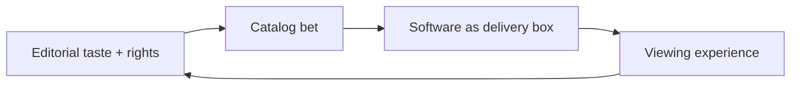

# Filmin

> Filmin runs product as a cinema curation house first — catalog taste and creator relationships lead; software is the black box that serves that editorial bet, not the other way around.

- Stage: scale
- Practices: discovery, delivery, roles, ai_product

## Iñigo Medina

### Operating loop

### Ownership

- **Discovery / prioritization:** editorial + CPO taste; product is secondary to content identity.
- **Shipping:** product/eng own the black-box apps that must not break the cinema experience.
- **Sales-led roadmap:** weak — retention is catalog identity, not growth hacks.

### Evidence

- *The product is very secondary for me. This is the point.*
- *Filming is a bit of an anomaly because in the race, let's call it the streaming race.*

[Source](../episodes/el-software-es-una-caja-negra-con-inigo-medina-cpo-de-filmin-parte-1-iMNLrbhi4cw.md)
