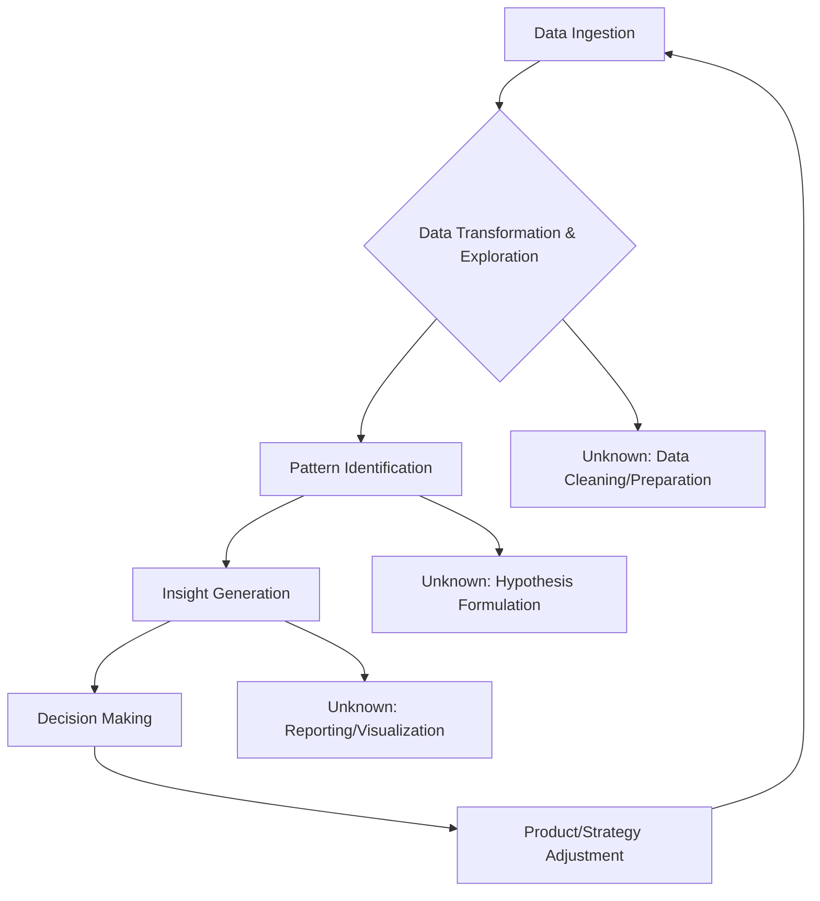
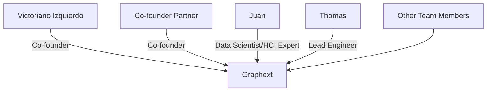

# Graphext

- Stage: enterprise
- Practices: enterprise, ai_product, discovery, delivery, org_shape
- Episodes: 1

## Guests

- Victoriano Izquierdo — Co-founder ([episode](../episodes/las-empresas-no-saben-usar-sus-datos-con-victoriano-izquierdo-co-funda-GgUE7OPRTfI.md))

## Victoriano Izquierdo

Victoriano Izquierdo, co-founder of Graphext, discusses the challenges and opportunities in data analysis for businesses. He emphasizes the importance of intuitive tools for non-technical users to explore data and derive insights, contrasting them with complex, desktop-bound traditional BI tools.

### Product workflow

### Roles & org

### Key moves

- Focus on creating intuitive, no-code tools that empower non-technical users to explore and understand complex data.
- Emphasize the concept of "flow" in product design, aiming for an engaging user experience where users lose track of time.
- Leverage AI to assist in data analysis, prototyping, and even in guiding user interactions within the product.
- Adopt a hybrid go-to-market strategy, combining a PLG model with enterprise services to support complex data adoption.

[Episode notes](../episodes/las-empresas-no-saben-usar-sus-datos-con-victoriano-izquierdo-co-funda-GgUE7OPRTfI.md)
