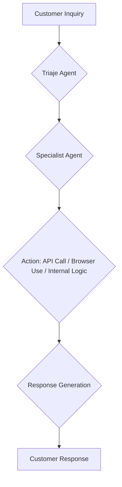

# GuruSup

> GuruSup runs support as an agent OS that takes actions end-to-end — not a reply-suggestion layer on top of human queues.

- Stage: growth
- Practices: ai_product, discovery, delivery, founder

## Victor Mollá

### Operating loop

### Ownership

- **Discovery:** Primarily driven by internal problems faced by the company and its founder's extensive experience with AI and customer support challenges.
- **Prioritization:** Focused on solving real customer problems with AI, aiming for broad applicability across SMEs rather than vertical specialization.
- **Shipping:** Rapid iteration and deployment, leveraging a small codebase and a willingness to pivot quickly based on market feedback and technological advancements.
- **Sales-input:** While not explicitly detailed, the product's development is informed by the challenges of customer onboarding and reducing friction in product adoption.
- **Design:** The product's design is heavily influenced by the capabilities of AI, aiming to reduce reliance on traditional UIs and dashboards in favor of conversational interfaces.

### Evidence

- *We are a system of agents that are capable of performing actions and that is when my mind opened and we saw that we could truly do end to end.*
- *Our competitors announce that they can answer 50% of tickets well. We can answer 100% well.*

[Source](../episodes/gestionamos-500-000-tickets-con-agentes-de-ia-product-demo-de-gurusup--pEj3I-sZhs4.md)
