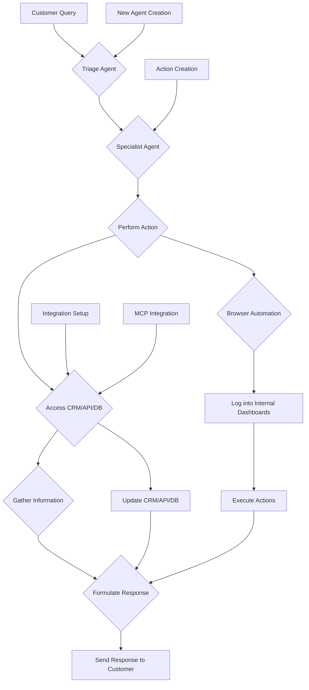
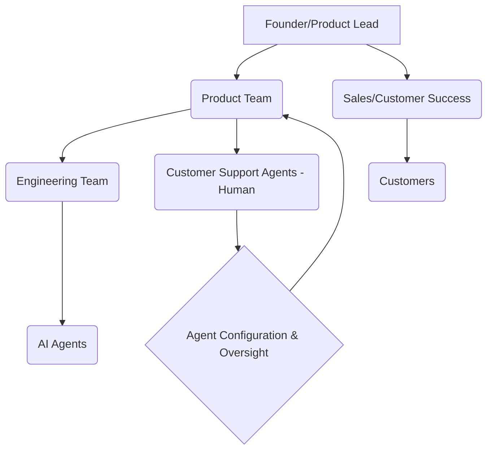
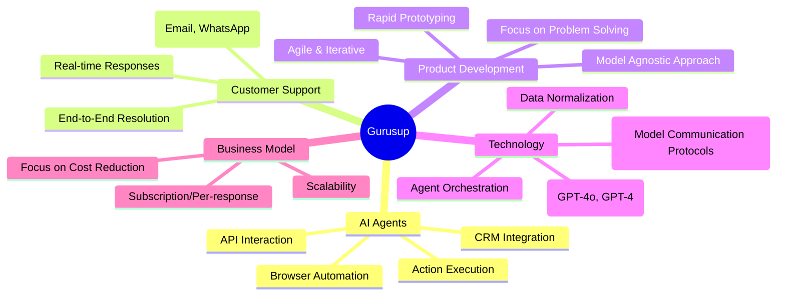

# GuruSup

- Stage: enterprise
- Practices: enterprise, ai_product, founder, platform
- Episodes: 1

## Guests

- Product Demo de GuruSup con Victor Mollá — Founder ([episode](../episodes/gestionamos-500-000-tickets-con-agentes-de-ia-product-demo-de-gurusup--pEj3I-sZhs4.md))

## Product Demo de GuruSup con Victor Mollá

Gurusup, founded by Victor Mollá, is developing an AI-powered customer support system designed to handle customer interactions end-to-end. Unlike traditional systems that rely on pre-written responses or basic information retrieval, Gurusup's agents can perform actions, access internal systems, and collaborate to resolve complex customer issues.

### Product workflow

### Roles & org

### Practice map

### Key moves

- **Agent-based action execution:** Gurusup's AI agents can perform actions within internal systems (CRM, databases) rather than just providing information.
- **MCP integration:** The use of Model Communication Protocols (MCPs) significantly speeds up integration with various third-party applications and internal systems.
- **Iterative development and pivoting:** The company has demonstrated a willingness to discard previous approaches and rebuild to adapt to technological advancements and market needs.
- **Focus on ease of use:** Despite the complexity of the underlying technology, Gurusup aims to provide a simple interface for configuring and managing AI agents and actions.

[Episode notes](../episodes/gestionamos-500-000-tickets-con-agentes-de-ia-product-demo-de-gurusup--pEj3I-sZhs4.md)
