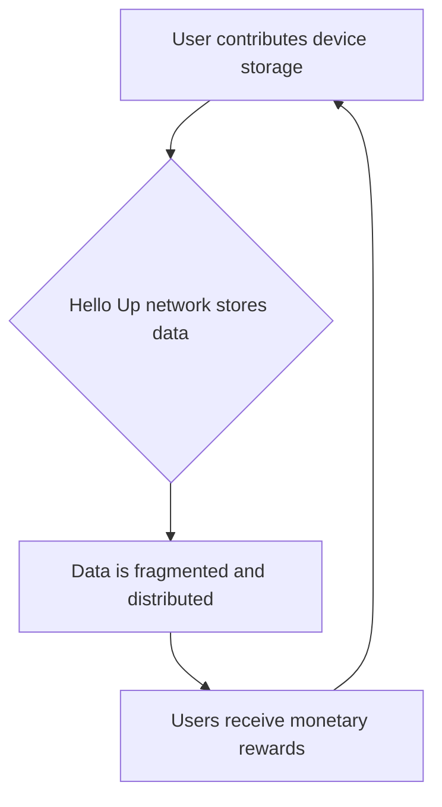

# hello.app

> hello.app monetizes idle device storage into a decentralized network — users earn by contributing unused capacity instead of renting centralized cloud.

- Stage: scale
- Practices: discovery, delivery, org_shape, roles

## 16 años con Alvaro Pintado

### Operating loop

### Ownership

- Discovery: Primarily driven by the founder, with input from the product designer and the open-source community.
- Prioritization: Led by the founder, who acts as the product manager, with input from the CTO and community.
- Shipping: Managed by the founder, coordinating with the CTO and the open-source contributors.
- Sales Input: Primarily from the founder, with early traction from Web3 businesses.
- Design: Co-led by the founder and the product designer.

### Evidence

- *The company's core innovation lies in creating the first decentralized storage network based on mobile devices worldwide.*
- *We are here not to be another startup, but to be the next Spanish unicorn.*

[Source](../episodes/fundar-una-startup-con-16-anos-con-alvaro-pintado-fundador-de-hello-ap-WiN6P2E8jbY.md)
