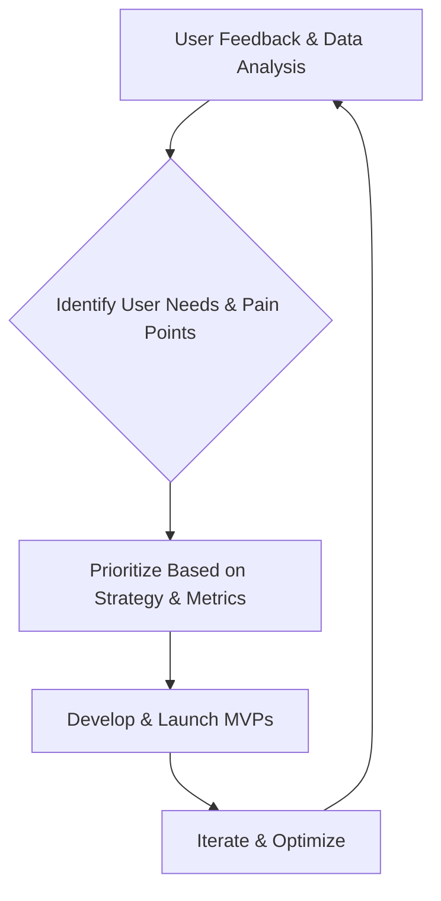

# HubSpot

> HubSpot mobile ships marketer journeys as fast MVPs — product adapts AI into on-the-go CRM workflows rather than waiting for perfect desktop parity.

- Stage: scale
- Practices: discovery, delivery, org_shape, roles, metrics, growth, platform

## Sara Guiral

### Operating loop

### Ownership

- **Discovery:** Product Manager (Sara Guiral) and Product Designer collaborate on user interviews and data analysis.
- **Prioritization:** Teams decide their own prioritization methods, influenced by company strategy, OKRs, and user feedback.
- **Shipping:** Global releases, with betas for high-risk features or undefined pricing.
- **Sales Input:** Collaboration with Customer Support and Sales teams to gather feedback and understand user blockers.
- **Design:** Product Designer (Ela) is a key partner, involved from discovery through to solutioning, with the final say on design.

### Evidence

- *My mission is to enable the marketer on the go.*
- *I prefer that a user complains rather than says nothing.*

[Source](../episodes/la-ai-se-va-a-quedar-con-sara-guiral-senior-pm-en-hubspot-5P9MfStTCOo.md)
