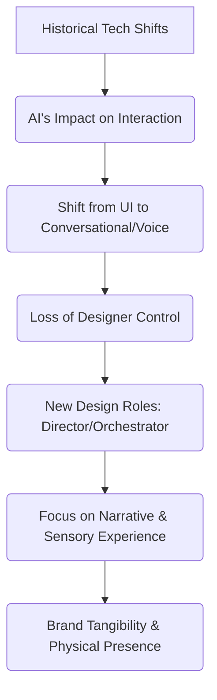

# Instituto Tramontana

> The future of product design will shift from optimizing user interfaces to embracing narrative, sensory experiences, and a deeper understanding of human psychology, especially as AI transforms interaction paradigms.

- Stage: other
- Practices: discovery, design, leadership

## Javier Cañada

### Operating loop

### Ownership

- **Discovery**: Primarily driven by understanding historical technological shifts and anticipating future paradigms.
- **Prioritization**: Focused on adapting to AI's transformative potential and the evolving nature of user interaction.
- **Shipping**: Emphasizes creating rich, sensory experiences and tangible brand presence, moving beyond purely digital interfaces.
- **Sales-input**: Not explicitly detailed, but the discussion implies a need for brands to differentiate through narrative and experience in a commoditized market.
- **Design**: Evolving from UI design to a broader role encompassing narrative, sensory input, and directing AI agents.

### Evidence

- *The bandwidth of communication is brutal, and that is transformative.*
- *The question perhaps is not how a voice CRM will be, but how we can not have a CRM.*

[Source](../episodes/el-mejor-diseno-es-el-no-diseno-javier-canada-fundador-de-instituto-tr-j7gcsyStHfQ.md)
