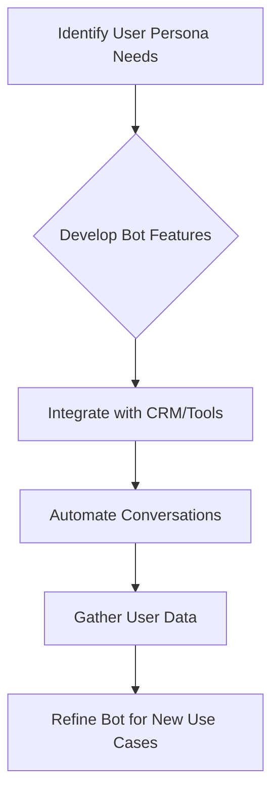

# Landbot

> Landbot democratizes conversational automation so non-engineers ship chatbots — product + PMM sell time saved on repetitive customer work.

- Stage: growth
- Practices: ai_product, discovery, delivery, roles

## Isabel Gárate

### Operating loop

### Ownership

- **Discovery**: Product Managers, Designers, and the broader team engage with business, sales, and marketing to understand user needs and pain points.
- **Prioritization**: Decisions are made collaboratively, considering strategy, OKRs, and potential impact, with a focus on solving problems and adding value.
- **Shipping**: Coordinated efforts between product, marketing, and sales ensure timely launches and effective communication of new features.
- **Sales Input**: Sales teams provide crucial feedback, with product managers encouraged to collaborate closely with them to understand underlying customer problems.
- **Design**: Product Managers and Designers are responsible for creating user-friendly interfaces and ensuring the product aligns with user needs and business goals.

### Evidence

- *The platform is so versatile that you can do anything you want. The downside is that it depends on how well the person does it.*
- *Our goal is that you don't have just one use case with us, but that you come to generate another different use case and generate more conversations.*

[Source](../episodes/el-rol-de-product-marketing-con-isabel-garate-vp-de-producto-en-landbo-JVJMex7UJAY.md)
