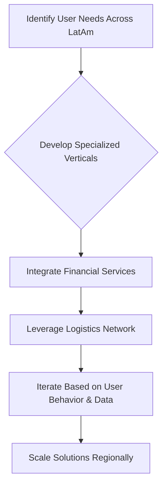

# Mercado Libre

> Mercado Libre ships product as an ecosystem of connected surfaces — each bet is judged by how it compounds the platform, not by a single app KPI.

- Stage: unknown
- Practices: ai_product, discovery, delivery, roles

## Patricio Navajas

### Operating loop

### Ownership

- **Discovery:** Product specialists and experts within verticals.
- **Prioritization:** Product leadership (VP of Product) and company leadership (CEO, CPO, CFO) decide on strategic battles and resource allocation.
- **Shipping:** Dedicated logistics network and teams.
- **Sales-Input:** Not explicitly detailed, but implied through understanding seller needs.
- **Design:** Integrated within product teams, leveraging shared capabilities.

### Evidence

- *We are user dream, we want to help the user, it is our main focus, giving them a great experience.*
- *We have capabilities that serve for everything, and I think the big challenge is the trade-offs, it's how you choose your next battles.*

[Source](../episodes/de-3-000-a-50-000-empleados-en-9-anos-patricio-navajas-head-of-product-JF8vk2M3EUw.md)
