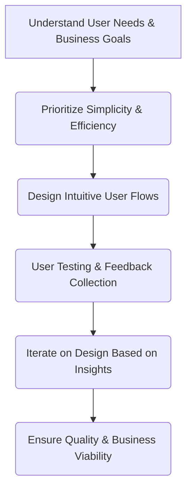

# Mercadona Tech

> Mercadona Tech runs product with the 3x model — explore, expand, extract — so teams pick methods by lifecycle phase instead of one-size-fits-all agile.

- Stage: scale
- Practices: discovery, delivery, roles, platform, design, leadership

## José Ramón Pérez

### Operating loop

- The 3x model by Ken Schwaber categorizes product development into three phases:
- **Explore:** Initial discovery, prototyping, and problem validation with low-quality code.
- **Expand:** Building core functionalities based on validated problems, shifting towards a feature-factory approach.
- **Extract:** Scaling and maintaining the product, focusing on return on investment with minimal changes.
- The model emphasizes knowing when a product transitions between these phases and adapting team behavior accordingly.

### Ownership

- **Discovery:** Primarily led by Product Designers, with Product Managers and domain specialists involved.
- **Prioritization:** Not explicitly detailed, but implied to be a collaborative effort within product teams.
- **Shipping:** Handled by engineering teams, with Product Managers ensuring value delivery.
- **Sales-input:** Not discussed.
- **Design:** Product Designers are central to discovery and defining product solutions.

### Evidence

- *A product has a life cycle of three phases: Explore, Expand, and Extract.*
- *The main value of 3x is explaining so simply: identify the phase, know the behavior for that phase.*

[Source](../episodes/el-framework-que-todo-product-manager-deberia-conocer-jose-ramon-perez-On0ZXCnvvs0.md)

## David de la Iglesia

### Operating loop

### Ownership

- **Discovery:** Primarily owned by Product Designers, who gather qualitative insights from users. Product Managers contribute with quantitative data analysis.
- **Prioritization:** Shared responsibility, with Product Managers owning quantitative data and Product Designers driving qualitative understanding.
- **Shipping:** Product Managers are responsible for the overall product strategy and ensuring the team can execute it.
- **Sales Input:** Not explicitly detailed, but the "customer is king" philosophy implies sales and business needs are central.
- **Design:** Owned by Product Designers, who are responsible for the user interface and overall user experience.

### Evidence

- *The customer is king, always having the boss at the center.*
- *We want to give the user or customer what they want, what they need, and not something that we want them to buy because they buy more things.*

[Source](../episodes/product-leaders-3-el-diseno-en-equipos-de-producto-con-david-de-la-igl-0FU447iVRfw.md)
