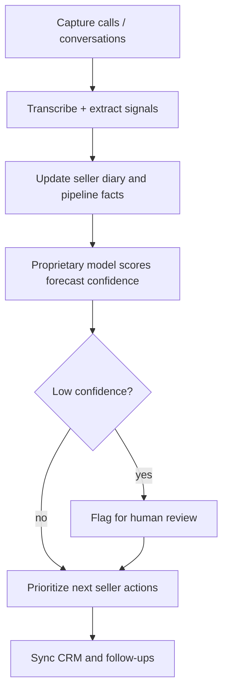

# Piper

> Piper is a data founder’s sales OS — proprietary models score pipeline forecasts and conversation confidence so sellers act on probability, not another CRM dashboard.

- Stage: early
- Practices: ai_product, founder, platform

## Michele Trevisiol

### Operating loop

### Ownership

- **Discovery:** Founder-led from a data/ML career (Jobandtalent data org, applied research) — the product bet is how sales data becomes a model, not a reporting layer.
- **Prioritization:** Forecast confidence and pipeline gaps decide what sellers see next.
- **Shipping:** Transcription → structured sales memory → model scores → CRM sync.
- **Sales input:** Sellers are the user; the co-founder frames the problem as maximizing time spent selling.
- **Design:** Diary-style interface that resumes meetings and surfaces what to ask next.

### Evidence

- Episode frames Piper as helping sellers “vender mucho más” by automating the information work around the sale.
- Forecast confidence and CRM sync are called out as product surfaces — the model should say when it does not trust the deal state.
- Guest path is explicitly data leadership (Jobandtalent SVP of Data) applied to a sales product, not a generic CRM rebuild.

[Source](../episodes/product-leaders-9-el-futuro-de-los-datos-con-michele-trevisiol-co-foun-t7Jsim7c1vY.md)
