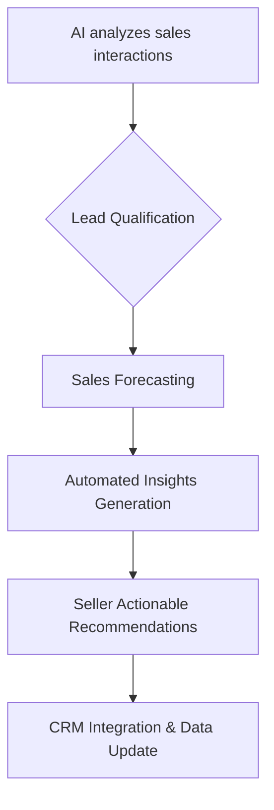

# Piper

> Piper automates sales lead qualification and forecasting with AI — product value is seller hours recovered, not another CRM dashboard.

- Stage: early
- Practices: ai_product, growth, platform

## Michele Trevisiol

### Operating loop

### Ownership

- **Discovery**: Unknown
- **Prioritization**: Unknown
- **Shipping**: Unknown
- **Sales Input**: Unknown
- **Design**: Unknown

### Evidence

- *The idea of a sales rep is to sell, and the AI's job is to maximize that.*
- *The AI's job is to maximize that, to give them the information they need to sell more.*

[Source](../episodes/product-leaders-9-el-futuro-de-los-datos-con-michele-trevisiol-co-foun-t7Jsim7c1vY.md)
