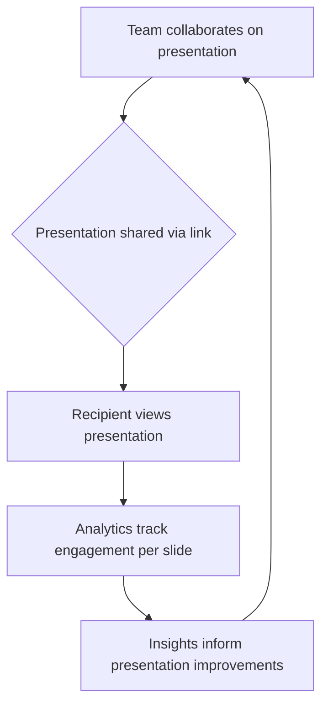

# Pitch

> Pitch competes on collaborative decks with design-system consistency — pricing and product assume presentations are team work, not solo PowerPoint files.

- Stage: growth
- Practices: discovery, delivery, roles, founder

## Ignasi Buch

### Operating loop

### Ownership

- **Discovery**: Primarily driven by user needs and market analysis, focusing on team collaboration and visual design.
- **Prioritization**: Influenced by the need to differentiate from established players like PowerPoint and Google Slides, focusing on unique selling propositions like analytics and collaborative features.
- **Shipping**: Involves iterative development based on user feedback and market trends, aiming to enhance engagement solutions beyond simple presentation creation.
- **Sales-input**: Likely comes from understanding team workflows and the need for professional, branded presentations.
- **Design**: A core focus, with an emphasis on visual quality, design consistency, and user experience.

### Evidence

- *Pitch is better in visual quality than Powerpoint and Google slides.*
- *Pitch is collaborative, and more beautiful than Google Lite and easier to have design consistency.*

[Source](../episodes/como-definir-el-pricing-de-un-producto-digital-con-ignasi-buch-head-of-phDAZajh7Rw.md)
