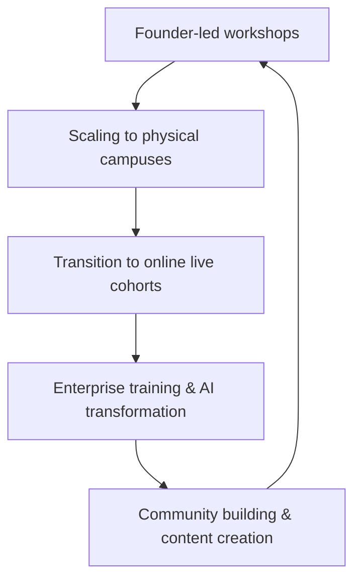

# Product School

> Product School scaled from founder bootcamps to enterprise AI training via live cohort learning and B2B partnerships — community is the distribution engine.

- Stage: enterprise
- Practices: enterprise, ai_product, discovery, delivery

## La mayor comunidad de Product Managers

### Operating loop

### Ownership

- **Discovery:** Founder-led initially, then through a dedicated routing team for speakers and instructors. Community feedback and enterprise client needs also drive discovery.
- **Prioritization:** Driven by market demand, particularly the shift towards AI transformation and enterprise needs.
- **Shipping:** Evolved from founder-led instruction to a scalable model with contracted instructors and a dedicated enterprise sales team.
- **Sales Input:** Primarily from enterprise clients and the growth of the B2C consumer business.
- **Design:** Initially handled by the founder, now likely by a product team focused on curriculum and platform development.

### Evidence

- *The business B2B eats more than 70 percent of B2C now.*
- *Our vision is now beyond product, to become the world leader in helping companies in their artificial intelligence transformation.*

[Source](../episodes/la-mayor-comunidad-de-product-managers-carlos-gonzalez-de-villaumbrosi-th22yAbrhFA.md)
