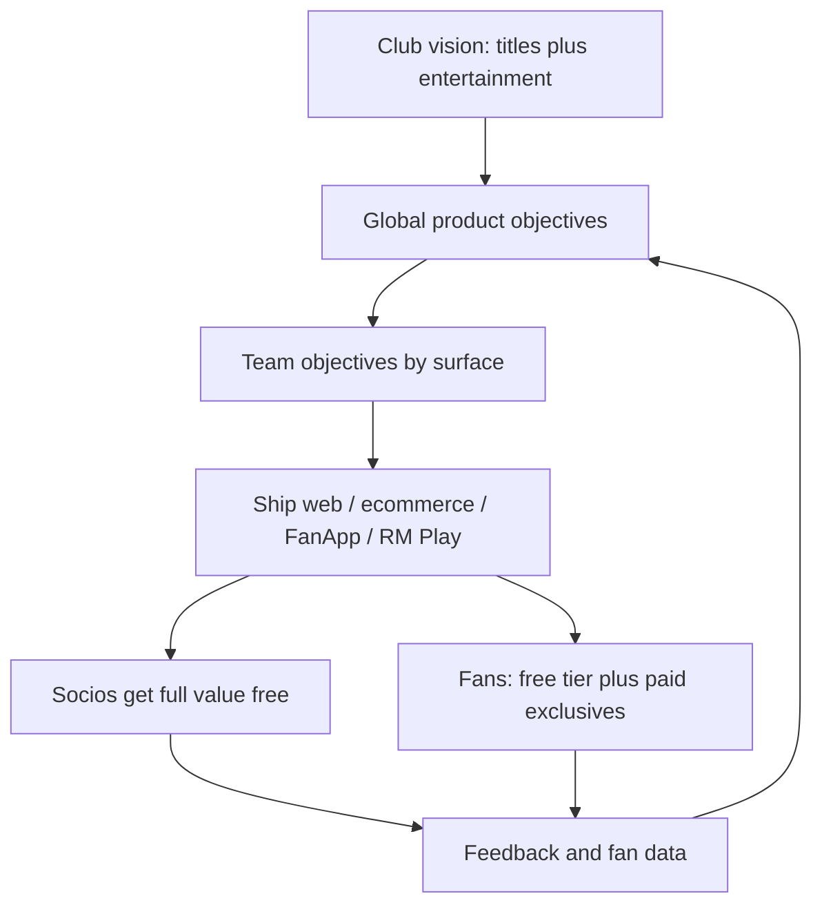

# Real Madrid

> Real Madrid never monetizes socios — digital product gives ~100k member-owners full value free (RM Play included) while the ~600M global fan base is the entertainment market competing with Netflix for attention.

- Stage: enterprise
- Practices: discovery, delivery, org_shape, growth

## Carlos Sánchez

### Operating loop

### Ownership

- **Discovery:** Fan and member data plus input from marketing, VIP, socios, and fan-facing teams — qualitative research is hard at 600M scale.
- **Prioritization:** Global objectives cascade to team goals; socios value is non-negotiable even when not monetized.
- **Shipping:** Surfaces launch to all user types at once; digital-native / younger fans tend to adopt first.
- **Sales-input:** Business areas (marketing, VIP, socios, fan teams) feed priorities — not a classic SaaS sales org.
- **Design:** Head of digital product comes from product design and previously led design teams; design is inside the product org.

### Evidence

- *We have about 600 million fans worldwide.*
- *We are competing not only with other clubs but also with people like Netflix for our users' attention.*
- *We never try to monetize our socios… RM Play is 100% free for socios.*

[Source](../episodes/liderar-producto-digital-real-madrid-carlos-sanchez-3BurkAX8YnQ.md)
