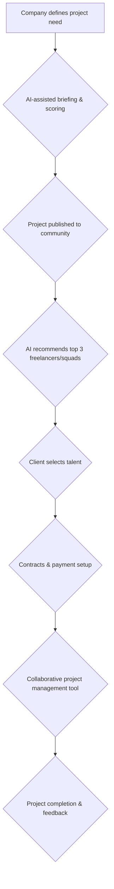

# Shakers

> Shakers’ north star is repeat clients, not one-off freelance matches — product pushes collaborative squads so companies come back for the next project.

- Stage: unknown
- Practices: ai_product, discovery, delivery, org_shape

## Adrián de Pedro

### Operating loop

### Ownership

- **Discovery:** Primarily driven by the client's project definition, with AI assistance and human intervention for lower-scoring briefs.
- **Prioritization:** AI-driven matching of freelancers to projects based on skills, project needs, and potentially personality fit.
- **Shipping:** Managed through a collaborative project management tool built by Shakers, with milestones unlocking payments.
- **Sales-input:** Handled by a sales machine that specializes by buyer persona, industry, and company size.
- **Design:** Supported by Shakers' product team and potentially external design consultants.

### Evidence

- *Shakers is born to create squads and be able to opt between unknown but brilliant people for bigger projects.*
- *Our North Star is that the client repeats.*

[Source](../episodes/nuestra-north-star-es-que-el-cliente-repita-con-adrian-de-pedro-cpto-d-vcTacjzmYlA.md)
