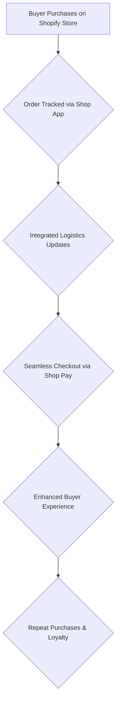

# Shopify

> On Shopify’s Shop app, PMs optimize the buyer side of commerce — checkout, payments, and post-purchase — so merchants win when shopping feels effortless.

- Stage: growth
- Practices: ai_product, discovery, delivery, roles

## David Garcia

### Operating loop

### Ownership

- **Discovery**: Primarily driven by buyer feedback and market trends, with a focus on improving the purchasing experience.
- **Prioritization**: Focused on enhancing buyer-centric features and integrating with Shopify's broader ecosystem.
- **Shipping**: Integrated logistics and direct-to-consumer tracking are core functionalities.
- **Sales Input**: While the app is B2C, insights from merchants using Shopify and buyer behavior data inform development.
- **Design**: Emphasis on a curated, user-friendly UI, particularly within the native app experience.

### Evidence

- *Shopify's mission is to make Commerce better for everyone, and Shop follows the same mission but is more focused on the buyer side.*
- *Shop Pay is the native payment solution within Shop, and it's the best converting in the market due to its smooth checkout process.*

[Source](../episodes/el-rol-de-product-manager-en-shopify-con-david-garcia-senior-pm-de-sho-_ApDFAiGPUM.md)
