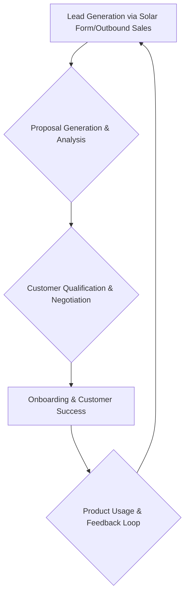

# Suntropy

> Suntropy abandoned PLG self-serve when conversion collapsed with the market — product acquisition flipped to sales-led because the funnel stopped working alone.

- Stage: growth
- Practices: discovery, growth, platform, enterprise

## Pablo Sánchez

### Operating loop

### Ownership

- **Discovery**: Primarily driven by sales input and direct customer feedback post-pivot. Previously, it was heavily influenced by product-led growth metrics and user behavior.
- **Prioritization**: Now influenced by sales team feedback and strategic business goals, shifting from PLG-driven feature adoption.
- **Shipping**: Developers, with input from product and sales, manage shipping.
- **Sales Input**: Directly incorporated through the new sales team and outbound efforts.
- **Design**: Primarily handled by developers, with a focus on intuitive UX integrated into the codebase rather than a dedicated design team.

### Evidence

- *We started to see that this wasn't working. Overnight, without changing anything in the product or marketing strategy, we started to see that this wasn't working.*
- *The market had changed drastically from one year to the next, and that doesn't usually happen in all markets.*

[Source](../episodes/nos-cayo-la-conversion-de-un-10-a-un-0-5-por-el-mercado-founder-suntro-aJRs_gQWXAQ.md)
