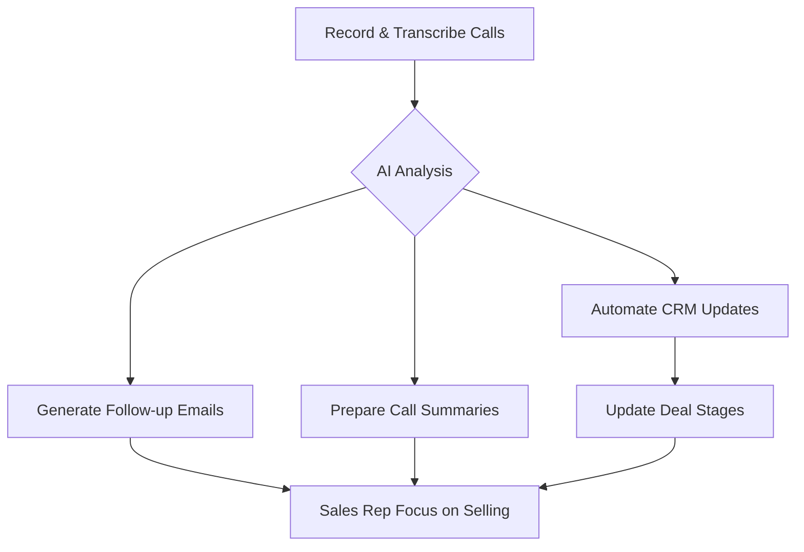

# Ting

> Ting sells sales automation that recovers the hours reps waste outside calling — product value is measurable talk-time and pipeline hygiene, not another CRM dashboard.

- Stage: early
- Practices: discovery, ai_product, growth, enterprise

## Marta Cavestany

### Operating loop

### Ownership

- **Discovery:** Supported by founder's direct experience with sales inefficiencies.
- **Prioritization:** Driven by solving the core pain point of sales reps spending excessive time on non-selling activities.
- **Shipping:** Focus on AI-driven automation of tasks like CRM updates and follow-up emails.
- **Sales-input:** Direct input from founder's background in a logistics company with a large sales team.
- **Design:** Product interface designed to resemble a CRM for ease of adoption.

### Evidence

- *The core problem identified was that salespeople were only spending an average of two and a half hours a day making calls.*
- *Ting is a software that helps salespeople sell more by being more efficient in their day-to-day.*

[Source](../episodes/los-comerciales-solo-llaman-2-horas-al-dia-marta-cavestany-ceo-founder-v8QuIhRXGIw.md)
