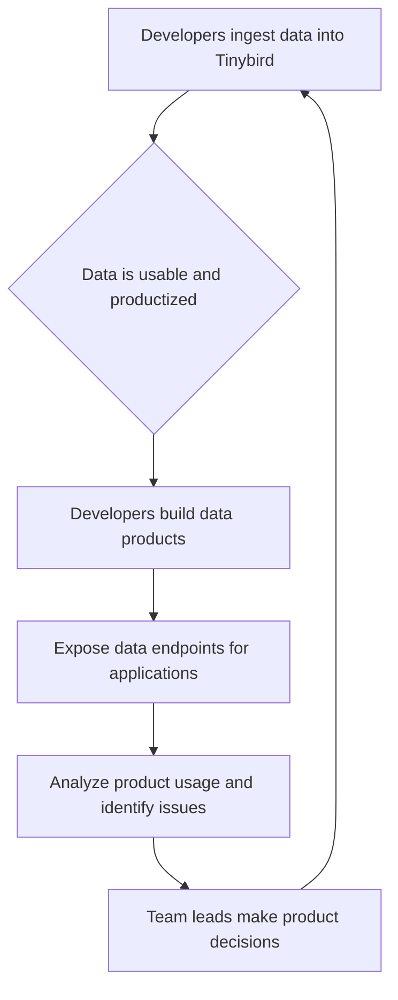

# Tinybird

> Tinybird deleted the PM layer so technical leads own product decisions for a developer audience that rejects classic PM mediation.

- Stage: enterprise
- Practices: enterprise, discovery, delivery, org_shape

## Javi Santana

### Operating loop

### Ownership

- **Discovery:** Team leads within product teams.
- **Prioritization:** Team leads within product teams.
- **Shipping:** Team leads within product teams (with full engineering responsibility).
- **Sales Input:** Unknown.
- **Design:** Unknown.

### Evidence

- *We eliminated the product team to be all product.*
- *The interesting part of Tinybird is that it's not a tool to just analyze data; it's a tool where data analysis is productized.*

[Source](../episodes/eliminamos-al-equipo-de-producto-para-ser-todos-producto-javi-santana--qMEVsemCo5c.md)
