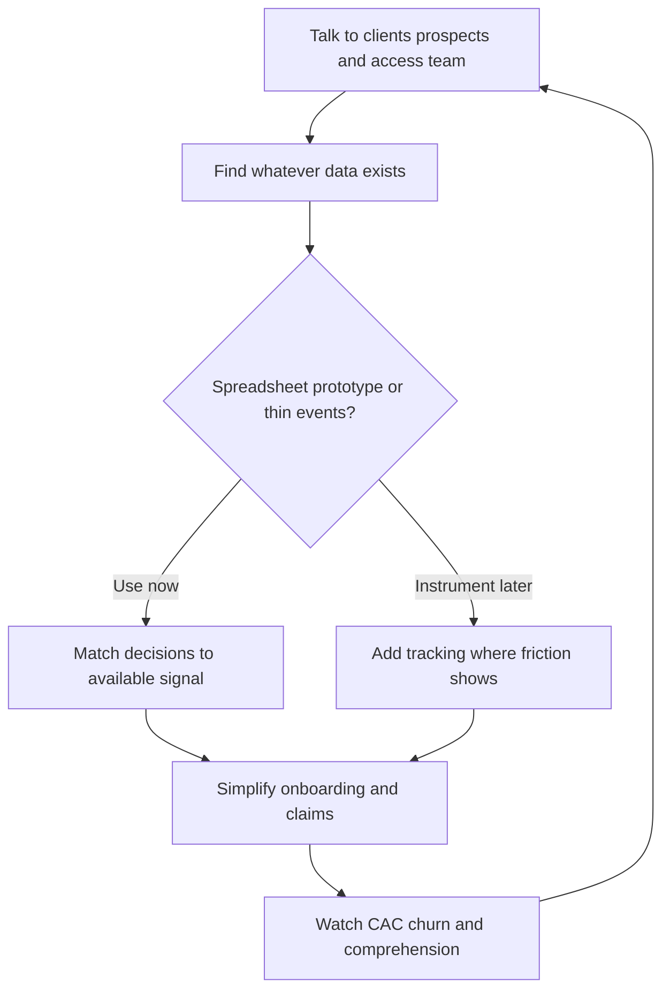

# Tuio

> Tuio starts data strategy with qualitative insight and whatever spreadsheet already exists — instrument later; early product decisions don’t wait on a perfect warehouse.

- Stage: growth
- Practices: discovery, delivery, metrics, growth

## Sara Diez

### Operating loop

### Ownership

- **Discovery:** CPO/product via client and prospect feedback, plus the customer-access team’s day-to-day signal.
- **Prioritization:** Product balances stakeholder asks against CAC, churn, and “does the customer understand what they bought?”
- **Shipping:** Small product + engineering team; designer partners closely with the CPO.
- **Sales-input:** B2C funnel and B2B partner channels feed needs; product stays in the loop.
- **Design:** Dedicated product designer under the CPO’s product org.

### Evidence

- *The most important thing is to understand how to extract intelligence from the data.*
- *Less is more when it comes to onboarding.*
- *The most important thing is that the client understands what they are contracting and how it works.*

[Source](../episodes/analisis-de-datos-para-product-managers-con-sara-diez-cpo-de-tuio-x85PIuWO_fg.md)
