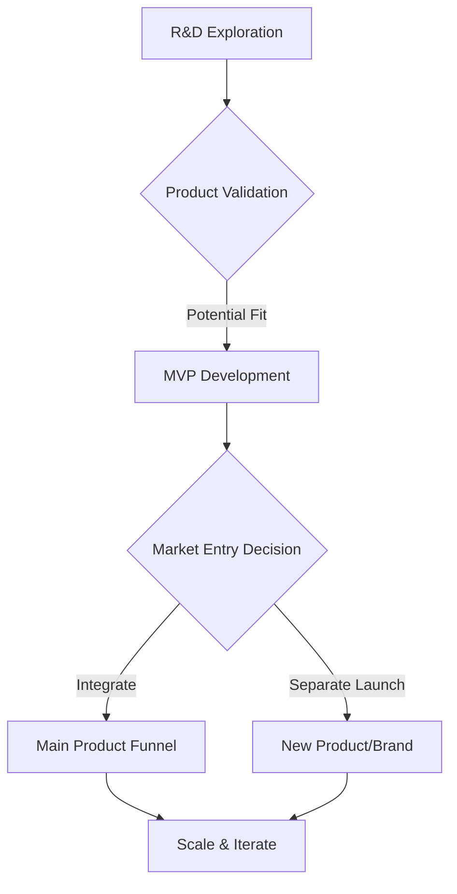

# Typeform

> Typeform ships without worshipping frameworks — founder-led R&D explores bets, then either folds them into the main form product or spins them as separate brands.

- Stage: early
- Practices: discovery, delivery, metrics, founder

## Arnau Romero

### Operating loop

### Ownership

- **Discovery**: R&D teams and founders explore new technologies and user needs.
- **Prioritization**: Decisions are made based on product fit, market potential, and strategic alignment.
- **Shipping**: Product makers and dedicated teams handle development and iteration.
- **Sales Input**: Incorporated through market analysis and customer feedback loops.
- **Design**: Heavily integrated from the start, with strong design teams influencing roadmap and product definition.

### Evidence

- *We had a R&D team that was led by David, the founder of Typeform... they explored many technologies.*
- *The main thing was to create a super strong brand and always put the user first through user experience.*

[Source](../episodes/trabajar-producto-sin-frameworks-arnau-romero-director-de-producto-de--hfVtB1w0xjc.md)
