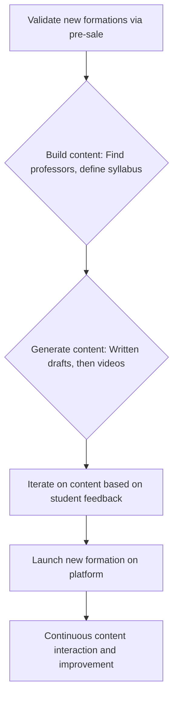

# Ucademy

> Ucademy runs content/education product as rapid business-driven iteration — ship value to the existing base before worshipping PM frameworks.

- Stage: early
- Practices: ai_product, discovery, delivery, roles

## Miquel Palet

### Operating loop

### Ownership

- Discovery: Primarily driven by sales team feedback and market demand for specific exams.
- Prioritization: Business-driven, focusing on delivering value to existing users and optimizing sales processes.
- Shipping: Rapid iteration and deployment to production to validate ideas.
- Sales Input: Heavily integrated into product decisions, with sales feedback shaping new offerings.
- Design: Supported by an internal team, with a focus on business needs and user experience.

### Evidence

- *The context changes very quickly, and if you're not there to see it, you can't propose solutions.*
- *We try to make the product team as close as possible to the business.*

[Source](../episodes/product-leaders-4-el-producto-en-negocios-de-contenido-con-miquel-pale-vQmWZsV_Qto.md)
