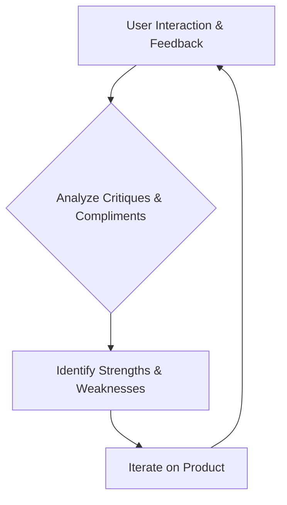

# Waynabox

> Waynabox design starts from the travel constraint and user job, not UI trends — especially when AI makes mediocre interfaces cheap to produce.

- Stage: growth
- Practices: enterprise, ai_product, discovery, delivery

## Alejandro Magro

### Operating loop

### Ownership

- **Discovery:** Product designer, with direct user interaction and analysis of feedback.
- **Prioritization:** Unclear, but designer is close to founders and CMO.
- **Shipping:** Unclear.
- **Sales Input:** Unclear, but designer considers B2B market movements.
- **Design:** Product designer, acting as guardian of the brand.

### Evidence

- *A product designer is someone who knows how to ask questions about the product they manage.*
- *Making product now is very easy, but making mediocre product is also very easy.*

[Source](../episodes/como-interactuaremos-con-la-tecnologia-alejandro-magro-lead-designer-e-k7JpTwQqnTo.md)
