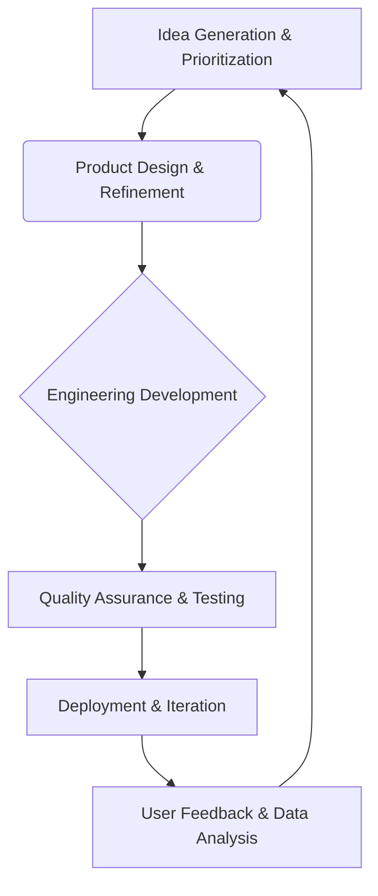

# Webel

> Webel treats retention and service marketplace liquidity as the product problem, not paid acquisition — grow demand only after supply-side quality holds.

- Stage: growth
- Practices: discovery, delivery, org_shape, roles

## Carlos Estévez

### Operating loop

### Ownership

- **Discovery:** Founders and the product team, with input from all company departments.
- **Prioritization:** Founders, with input from a product committee that includes representatives from relevant departments.
- **Shipping:** A single product squad responsible for end-to-end development.
- **Sales Input:** Not explicitly detailed, but expansion team provides market insights.
- **Design:** Product designers who are deeply involved in product and business strategy.

### Evidence

- *We are very focused on this precisely because to raise money all the VCs said this market is the typical one where people go off-platform or leakage.*
- *We bet literally with the casino all on red, all on product.*

[Source](../episodes/asi-es-como-encontramos-el-product-market-fit-carlos-estevez-cpo-de-we-XcAYDqg2sWA.md)
