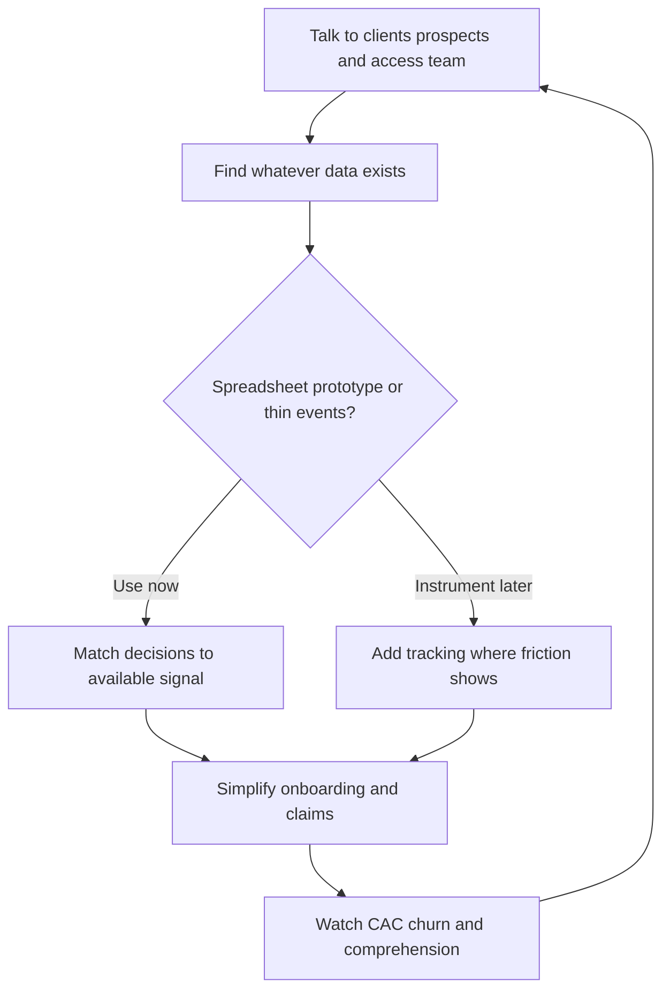

## Thesis
Tuio starts data strategy with qualitative insight and whatever spreadsheet already exists — instrument later; early product decisions don’t wait on a perfect warehouse.

## Context
Sara Diez is CPO at Tuio, a home insurtech (~20k customers at interview) selling transparent, digital-first home insurance with a human fallback when customers want it.

## Operating loop

## Ownership
- **Discovery:** CPO/product via client and prospect feedback, plus the customer-access team’s day-to-day signal.
- **Prioritization:** Product balances stakeholder asks against CAC, churn, and “does the customer understand what they bought?”
- **Shipping:** Small product + engineering team; designer partners closely with the CPO.
- **Sales-input:** B2C funnel and B2B partner channels feed needs; product stays in the loop.
- **Design:** Dedicated product designer under the CPO’s product org.

## Evidence
- *The most important thing is to understand how to extract intelligence from the data.*
- *Less is more when it comes to onboarding.*
- *The most important thing is that the client understands what they are contracting and how it works.*

## Gaps
- Exact analytics stack and event taxonomy are not named.
- Cadence of experimentation / A-B testing is not detailed.
- How actuarial / pricing ownership sits next to product is only sketched.

## Listen

- YouTube: [Análisis de Datos para Product Managers con Sara Diez CPO de Tuio](https://www.youtube.com/watch?v=x85PIuWO_fg)
- Audio: [episode audio](https://anchor.fm/s/ddca5200/podcast/play/78021972/https%3A%2F%2Fd3ctxlq1ktw2nl.cloudfront.net%2Fstaging%2F2023-10-1%2F353652493-44100-2-6fa7ad5374b67.mp3)
- Show: [Entrevistas a Product Leaders](https://podcasters.spotify.com/pod/show/danidiestre)
- Host: [Dani Diestre](https://www.youtube.com/@DaniDiestre)

_Unofficial community note. Episode © host / guests. See [docs/LEGAL.md](../docs/LEGAL.md)._
