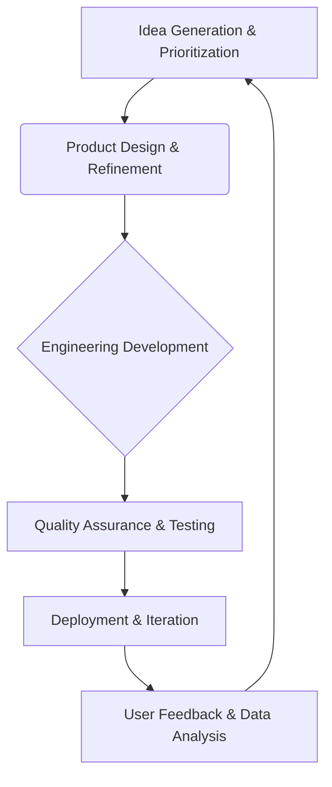

## Thesis
Webel treats retention and service marketplace liquidity as the product problem, not paid acquisition — grow demand only after supply-side quality holds.

## Context
Webel is a Spanish B2C marketplace connecting users with home service professionals, operating in a highly competitive and historically difficult market. The company has navigated significant challenges, including finding product-market fit and surviving the COVID-19 pandemic, to establish a scalable business model.

## Operating loop

## Ownership
*   **Discovery:** Founders and the product team, with input from all company departments.
*   **Prioritization:** Founders, with input from a product committee that includes representatives from relevant departments.
*   **Shipping:** A single product squad responsible for end-to-end development.
*   **Sales Input:** Not explicitly detailed, but expansion team provides market insights.
*   **Design:** Product designers who are deeply involved in product and business strategy.

## Evidence
*   *We are very focused on this precisely because to raise money all the VCs said this market is the typical one where people go off-platform or leakage.*
*   *We bet literally with the casino all on red, all on product.*

## Gaps
*   The specific mechanisms for how the expansion team identifies and validates new service categories or markets are not fully detailed.
*   While the company emphasizes product-led growth, the precise metrics and rituals for ongoing product strategy refinement beyond the monthly founder meetings are not elaborated upon.
*   The interview does not detail how they handle the onboarding of new professionals to ensure quality and adherence to platform standards.

## Listen

- YouTube: [Así es como encontramos el Product Market Fit | Carlos Estévez, CPO de Webel](https://www.youtube.com/watch?v=XcAYDqg2sWA)
- Audio: [episode audio](https://anchor.fm/s/ddca5200/podcast/play/100073997/https%3A%2F%2Fd3ctxlq1ktw2nl.cloudfront.net%2Fstaging%2F2025-2-19%2F396850536-44100-2-7c0284866a19f.mp3)
- Show: [Entrevistas a Product Leaders](https://podcasters.spotify.com/pod/show/danidiestre)
- Host: [Dani Diestre](https://www.youtube.com/@DaniDiestre)

_Unofficial community note. Episode © host / guests. See [docs/LEGAL.md](../docs/LEGAL.md)._
