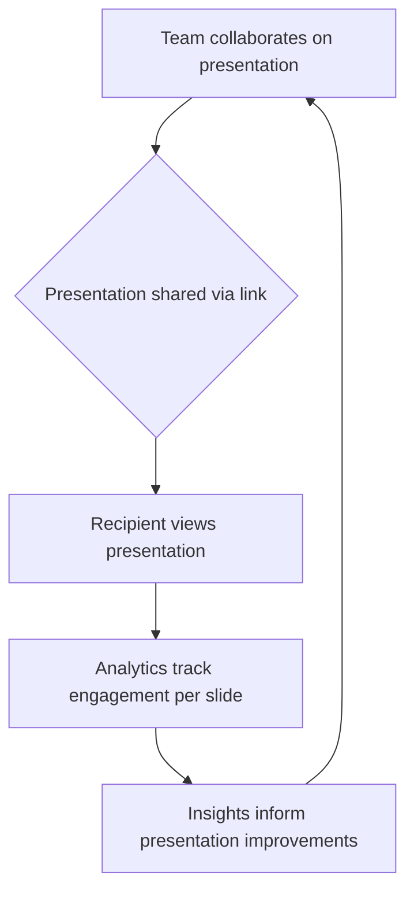

## Thesis
Pitch competes on collaborative decks with design-system consistency — pricing and product assume presentations are team work, not solo PowerPoint files.

## Context
Pitch is a collaborative presentation software company founded by individuals who previously sold a startup to Microsoft. They aim to create modern, visually appealing presentations with minimal effort, targeting teams that need flexible design control and collaborative features.

## Operating loop

## Ownership
- **Discovery**: Primarily driven by user needs and market analysis, focusing on team collaboration and visual design.
- **Prioritization**: Influenced by the need to differentiate from established players like PowerPoint and Google Slides, focusing on unique selling propositions like analytics and collaborative features.
- **Shipping**: Involves iterative development based on user feedback and market trends, aiming to enhance engagement solutions beyond simple presentation creation.
- **Sales-input**: Likely comes from understanding team workflows and the need for professional, branded presentations.
- **Design**: A core focus, with an emphasis on visual quality, design consistency, and user experience.

## Evidence
- *Pitch is better in visual quality than Powerpoint and Google slides.*
- *Pitch is collaborative, and more beautiful than Google Lite and easier to have design consistency.*

## Gaps
- The specific metrics used to measure the success of collaborative features are not detailed.
- The exact process for integrating analytics into the presentation creation workflow is not fully elaborated.
- The company's strategy for competing with deeply entrenched market leaders like PowerPoint and Google Slides beyond feature differentiation is not fully explored.

## Listen

- YouTube: [¿Cómo definir el Pricing de un Producto Digital? con Ignasi Buch, Head of Product de Pitch](https://www.youtube.com/watch?v=phDAZajh7Rw)
- Audio: [episode audio](https://anchor.fm/s/ddca5200/podcast/play/74152517/https%3A%2F%2Fd3ctxlq1ktw2nl.cloudfront.net%2Fstaging%2F2023-7-2%2F341601108-44100-2-4ae0d1adb689a.mp3)
- Show: [Entrevistas a Product Leaders](https://podcasters.spotify.com/pod/show/danidiestre)
- Host: [Dani Diestre](https://www.youtube.com/@DaniDiestre)

_Unofficial community note. Episode © host / guests. See [docs/LEGAL.md](../docs/LEGAL.md)._
