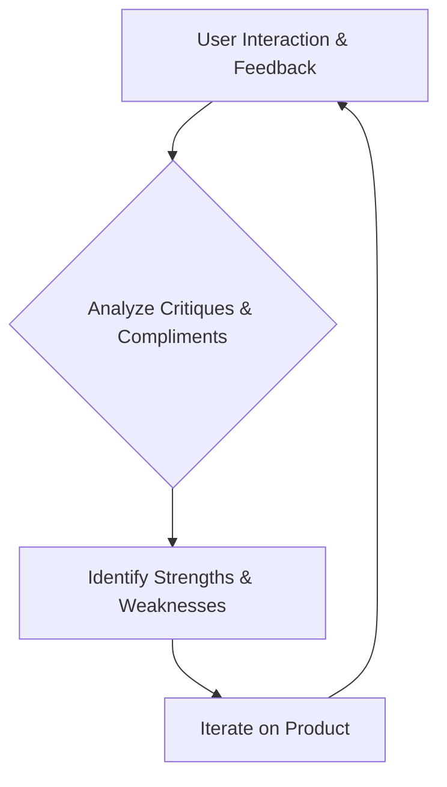

## Thesis
Waynabox design starts from the travel constraint and user job, not UI trends — especially when AI makes mediocre interfaces cheap to produce.

## Context
Alejandro Magro, Head of Design at Waynabox, discusses the evolving landscape of product design, the impact of AI, and the future of user interfaces. Waynabox operates in the travel tech sector.

## Operating loop

## Ownership
- **Discovery:** Product designer, with direct user interaction and analysis of feedback.
- **Prioritization:** Unclear, but designer is close to founders and CMO.
- **Shipping:** Unclear.
- **Sales Input:** Unclear, but designer considers B2B market movements.
- **Design:** Product designer, acting as guardian of the brand.

## Evidence
- *A product designer is someone who knows how to ask questions about the product they manage.*
- *Making product now is very easy, but making mediocre product is also very easy.*

## Gaps
- The specific process for prioritization and shipping is not detailed.
- The company's stage (early, growth, scale) is not explicitly stated.
- Details on how the company specifically leverages AI beyond general time-saving are limited.

## Listen

- YouTube: [¿Cómo interactuaremos con la tecnología? | Alejandro Magro, Lead Designer en Waynabox](https://www.youtube.com/watch?v=k7JpTwQqnTo)
- Audio: [episode audio](https://anchor.fm/s/ddca5200/podcast/play/104643754/https%3A%2F%2Fd3ctxlq1ktw2nl.cloudfront.net%2Fstaging%2F2025-5-25%2F402815316-44100-2-23c06628a269f.mp3)
- Show: [Entrevistas a Product Leaders](https://podcasters.spotify.com/pod/show/danidiestre)
- Host: [Dani Diestre](https://www.youtube.com/@DaniDiestre)

_Unofficial community note. Episode © host / guests. See [docs/LEGAL.md](../docs/LEGAL.md)._
