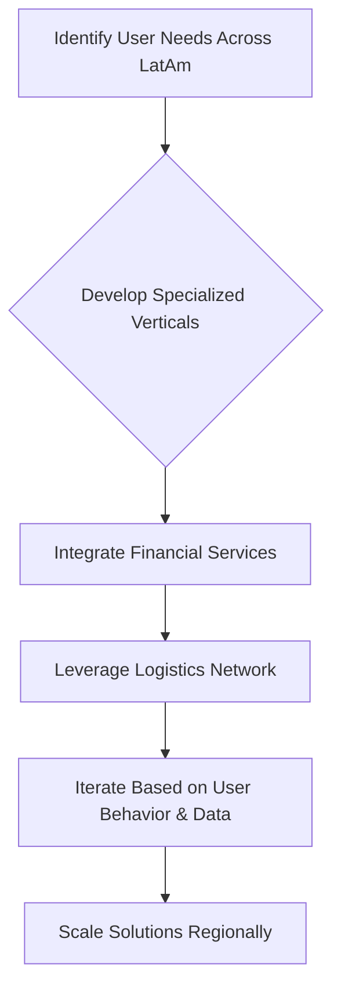

## Thesis
Mercado Libre ships product as an ecosystem of connected surfaces — each bet is judged by how it compounds the platform, not by a single app KPI.

## Context
Mercado Libre is a dominant e-commerce and fintech platform operating across Latin America, having grown from 3,000 to over 50,000 employees in nine years. It offers a wide range of services beyond its core marketplace, including payments, logistics, and specialized verticals like vehicles, real estate, and financial services.

## Operating loop

## Ownership
- **Discovery:** Product specialists and experts within verticals.
- **Prioritization:** Product leadership (VP of Product) and company leadership (CEO, CPO, CFO) decide on strategic battles and resource allocation.
- **Shipping:** Dedicated logistics network and teams.
- **Sales-Input:** Not explicitly detailed, but implied through understanding seller needs.
- **Design:** Integrated within product teams, leveraging shared capabilities.

## Evidence
- *We are user dream, we want to help the user, it is our main focus, giving them a great experience.*
- *We have capabilities that serve for everything, and I think the big challenge is the trade-offs, it's how you choose your next battles.*

## Gaps
- Specific details on how product managers prioritize within their verticals.
- The exact process for defining and measuring success for new features or verticals.
- How AI is being integrated beyond summarizing reviews and improving customer service.

## Listen

- YouTube: ["De 3.000 a 50.000 empleados en 9 años" | Patricio Navajas, Head of Product de Mercado Libre](https://www.youtube.com/watch?v=JF8vk2M3EUw)
- Audio: [episode audio](https://anchor.fm/s/ddca5200/podcast/play/94300929/https%3A%2F%2Fd3ctxlq1ktw2nl.cloudfront.net%2Fstaging%2F2024-10-12%2F389666568-44100-2-bc9969d4d2ed3.mp3)
- Show: [Entrevistas a Product Leaders](https://podcasters.spotify.com/pod/show/danidiestre)
- Host: [Dani Diestre](https://www.youtube.com/@DaniDiestre)

_Unofficial community note. Episode © host / guests. See [docs/LEGAL.md](../docs/LEGAL.md)._
