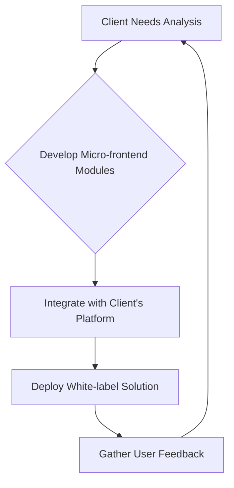

## Thesis
Clevergy sells white-label energy SaaS to utilities and solar installers — product deepens their customer relationships instead of competing for end users.

## Context
Clevergy provides a software-as-a-service platform for energy commercialization companies and solar panel installers. The company operates in a growth stage, aiming to help its clients improve customer retention, reduce operational costs, and differentiate themselves in a competitive market.

## Operating loop

## Ownership
*   **Discovery:** Product team, driven by client feedback and market analysis.
*   **Prioritization:** Co-founders (Product, CTO, Sales) collaborate on roadmap decisions.
*   **Shipping:** Product and Engineering teams manage the development and deployment lifecycle.
*   **Sales Input:** Sales team provides direct market feedback and client requirements.
*   **Design:** Product and UX designers work on user interface and experience, ensuring brand consistency for clients.

## Evidence
*   *We sell a white-label application with their brand and look and feel to give to their clients.*
*   *The value proposition is brutal for improving time to market; the micro-frontend plugs into their application.*

## Gaps
*   The interview does not detail specific metrics used to measure product success beyond client adoption and retention.
*   Information regarding the internal product development methodologies (e.g., specific Agile frameworks beyond mention of sprints) is not elaborated upon.
*   The long-term technical architecture strategy beyond micro-frontends and webviews is not discussed.

## Listen

- YouTube: ["De Consultoría Industrial a Product Management" con Álvaro Pérez, Founder y CPO de Clevergy](https://www.youtube.com/watch?v=6ctQIvhwj2g)
- Audio: [episode audio](https://anchor.fm/s/ddca5200/podcast/play/81707081/https%3A%2F%2Fd3ctxlq1ktw2nl.cloudfront.net%2Fstaging%2F2024-0-24%2F364719601-44100-2-b001f0008965f.mp3)
- Show: [Entrevistas a Product Leaders](https://podcasters.spotify.com/pod/show/danidiestre)
- Host: [Dani Diestre](https://www.youtube.com/@DaniDiestre)

_Unofficial community note. Episode © host / guests. See [docs/LEGAL.md](../docs/LEGAL.md)._
