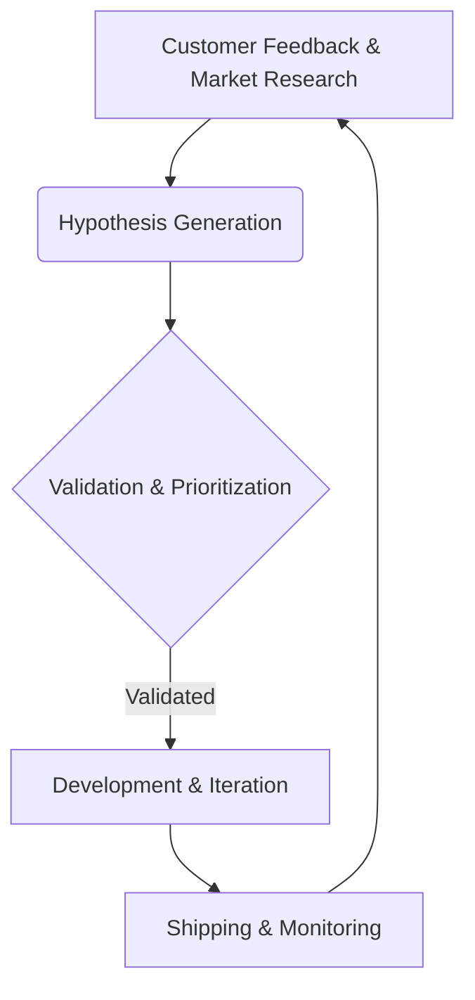

## Thesis
Corti's team prioritizes product discovery and validation through a structured, continuous process to inform their delivery cycle.

## Context
Product Hackers offers educational content and community for product professionals. The company appears to be in a growth or scale stage, serving a market focused on product management and growth strategies.

## Operating loop

## Ownership
*   **Discovery:** Owned by the product team, involving customer feedback and market research.
*   **Prioritization:** Based on validation of hypotheses.
*   **Shipping:** Part of the iterative development cycle.
*   **Sales-input:** Not explicitly mentioned.
*   **Design:** Not explicitly mentioned.

## Evidence
*The Growth Manager is the new CEO of the company.*

## Gaps
*   The specific metrics used to measure success are not detailed.
*   The exact structure of product teams and their reporting lines is unclear.
*   The role of engineering in the discovery and prioritization process is not elaborated upon.

## Listen

- YouTube: ["El Growth Manager es el nuevo CEO de la compañía" | Corti CMO & COO de Product Hackers](https://www.youtube.com/watch?v=HDzhA_UFrnA)
- Audio: [episode audio](https://anchor.fm/s/ddca5200/podcast/play/93077672/https%3A%2F%2Fd3ctxlq1ktw2nl.cloudfront.net%2Fstaging%2F2024-9-15%2F388143820-44100-2-2fe0d0949d968.mp3)
- Show: [Entrevistas a Product Leaders](https://podcasters.spotify.com/pod/show/danidiestre)
- Host: [Dani Diestre](https://www.youtube.com/@DaniDiestre)

_Unofficial community note. Episode © host / guests. See [docs/LEGAL.md](../docs/LEGAL.md)._
