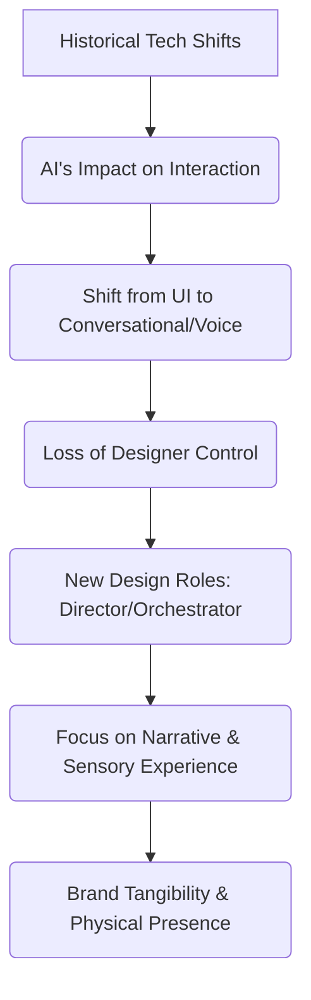

---
title: "\"El Mejor Diseño es el No Diseño\" | Javier Cañada, fundador de Instituto Tramontana"
youtube_id: "j7gcsyStHfQ"
url: "https://www.youtube.com/watch?v=j7gcsyStHfQ"
audio_url: "https://anchor.fm/s/ddca5200/podcast/play/101024558/https%3A%2F%2Fd3ctxlq1ktw2nl.cloudfront.net%2Fstaging%2F2025-3-8%2F398066019-44100-2-0a791bca9afa6.mp3"
pub_date: "2025-04-09T14:30:00.000Z"
guest: "Javier Cañada"
role: "fundador"
company: "Instituto Tramontana"
company_slug: "instituto-tramontana"
stage: "other"
practices: ["discovery", "design", "leadership"]
status: weak
processed_at: 2026-08-03T17:53:50.292Z
---

## Thesis
The future of product design will shift from optimizing user interfaces to embracing narrative, sensory experiences, and a deeper understanding of human psychology, especially as AI transforms interaction paradigms.

## Context
Instituto Tramontana is an educational institution focused on product design, brand, and leadership, emphasizing interdisciplinary learning and experiential environments. The discussion centers on the evolution of user interaction with technology, particularly in the age of AI, and its implications for product development and brand identity.

## Operating loop

## Ownership
*   **Discovery**: Primarily driven by understanding historical technological shifts and anticipating future paradigms.
*   **Prioritization**: Focused on adapting to AI's transformative potential and the evolving nature of user interaction.
*   **Shipping**: Emphasizes creating rich, sensory experiences and tangible brand presence, moving beyond purely digital interfaces.
*   **Sales-input**: Not explicitly detailed, but the discussion implies a need for brands to differentiate through narrative and experience in a commoditized market.
*   **Design**: Evolving from UI design to a broader role encompassing narrative, sensory input, and directing AI agents.

## Evidence
*   *The bandwidth of communication is brutal, and that is transformative.*
*   *The question perhaps is not how a voice CRM will be, but how we can not have a CRM.*

## Gaps
*   Specific methodologies for integrating AI into existing product development workflows are not detailed.
*   The precise operational cadence and team structures at Instituto Tramontana are not elaborated upon.
*   Concrete examples of how businesses are currently implementing these future-focused design principles beyond theoretical discussion are limited.

## Listen

- YouTube: ["El Mejor Diseño es el No Diseño" | Javier Cañada, fundador de Instituto Tramontana](https://www.youtube.com/watch?v=j7gcsyStHfQ)
- Audio: [episode audio](https://anchor.fm/s/ddca5200/podcast/play/101024558/https%3A%2F%2Fd3ctxlq1ktw2nl.cloudfront.net%2Fstaging%2F2025-3-8%2F398066019-44100-2-0a791bca9afa6.mp3)
- Show: [Entrevistas a Product Leaders](https://podcasters.spotify.com/pod/show/danidiestre)
- Host: [Dani Diestre](https://www.youtube.com/@DaniDiestre)

_Unofficial community note. Episode © host / guests. See [docs/LEGAL.md](../docs/LEGAL.md)._
