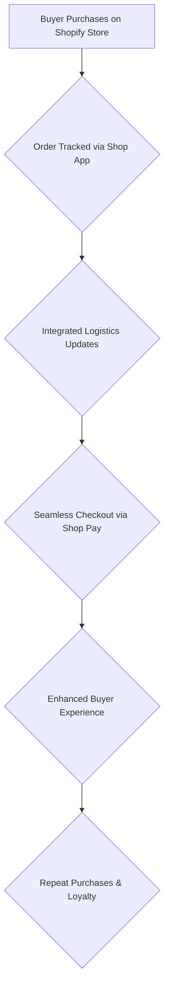

## Thesis
On Shopify’s Shop app, PMs optimize the buyer side of commerce — checkout, payments, and post-purchase — so merchants win when shopping feels effortless.

## Context
Shopify's Shop app is a B2C marketplace and order tracker that evolved from a simple order tracking tool to a robust platform. It aims to provide buyers with a superior shopping experience, integrating directly with Shopify's payment system, Shop Pay, which boasts high conversion rates.

## Operating loop

## Ownership
- **Discovery**: Primarily driven by buyer feedback and market trends, with a focus on improving the purchasing experience.
- **Prioritization**: Focused on enhancing buyer-centric features and integrating with Shopify's broader ecosystem.
- **Shipping**: Integrated logistics and direct-to-consumer tracking are core functionalities.
- **Sales Input**: While the app is B2C, insights from merchants using Shopify and buyer behavior data inform development.
- **Design**: Emphasis on a curated, user-friendly UI, particularly within the native app experience.

## Evidence
- *Shopify's mission is to make Commerce better for everyone, and Shop follows the same mission but is more focused on the buyer side.*
- *Shop Pay is the native payment solution within Shop, and it's the best converting in the market due to its smooth checkout process.*

## Gaps
- The specific strategies for acquiring new users to the Shop app beyond existing Shopify store purchases are not detailed.
- The internal team structure and how cross-functional collaboration occurs within the Shop app's growth team are not fully elaborated.
- The long-term vision for AI integration within the Shop app beyond general trends is not specified.

## Listen

- YouTube: [El rol de Product Manager en Shopify con David Garcia, Senior PM de Shopify](https://www.youtube.com/watch?v=_ApDFAiGPUM)
- Audio: [episode audio](https://anchor.fm/s/ddca5200/podcast/play/77067920/https%3A%2F%2Fd3ctxlq1ktw2nl.cloudfront.net%2Fstaging%2F2023-9-11%2F350672344-44100-2-1c02dcf0502ee.mp3)
- Show: [Entrevistas a Product Leaders](https://podcasters.spotify.com/pod/show/danidiestre)
- Host: [Dani Diestre](https://www.youtube.com/@DaniDiestre)

_Unofficial community note. Episode © host / guests. See [docs/LEGAL.md](../docs/LEGAL.md)._
