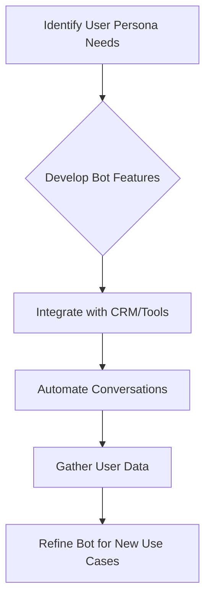

## Thesis
Landbot democratizes conversational automation so non-engineers ship chatbots — product + PMM sell time saved on repetitive customer work.

## Context
Landbot offers a no-code platform for building chatbots that automate conversations across various channels like web, WhatsApp, and Telegram. The company targets small to medium-sized businesses looking to automate high volumes of customer interactions for lead generation and support.

## Operating loop

## Ownership
- **Discovery**: Product Managers, Designers, and the broader team engage with business, sales, and marketing to understand user needs and pain points.
- **Prioritization**: Decisions are made collaboratively, considering strategy, OKRs, and potential impact, with a focus on solving problems and adding value.
- **Shipping**: Coordinated efforts between product, marketing, and sales ensure timely launches and effective communication of new features.
- **Sales Input**: Sales teams provide crucial feedback, with product managers encouraged to collaborate closely with them to understand underlying customer problems.
- **Design**: Product Managers and Designers are responsible for creating user-friendly interfaces and ensuring the product aligns with user needs and business goals.

## Evidence
*The platform is so versatile that you can do anything you want. The downside is that it depends on how well the person does it.*
*Our goal is that you don't have just one use case with us, but that you come to generate another different use case and generate more conversations.*

## Gaps
The interview does not detail specific metrics used to measure the success of individual chatbot use cases beyond general satisfaction, especially when the purpose of the bot is not explicitly defined. There is also limited information on how Landbot handles technical debt versus product debt and the specific processes for prioritizing these. The exact structure and cadence of A/B testing for new features or AI models are not elaborated upon.

## Listen

- YouTube: [El rol de Product Marketing con Isabel Gárate, VP de Producto en Landbot](https://www.youtube.com/watch?v=JVJMex7UJAY)
- Audio: [episode audio](https://anchor.fm/s/ddca5200/podcast/play/72954170/https%3A%2F%2Fd3ctxlq1ktw2nl.cloudfront.net%2Fstaging%2F2023-6-3%2F337892749-44100-2-7174e86d68bee.mp3)
- Show: [Entrevistas a Product Leaders](https://podcasters.spotify.com/pod/show/danidiestre)
- Host: [Dani Diestre](https://www.youtube.com/@DaniDiestre)

_Unofficial community note. Episode © host / guests. See [docs/LEGAL.md](../docs/LEGAL.md)._
