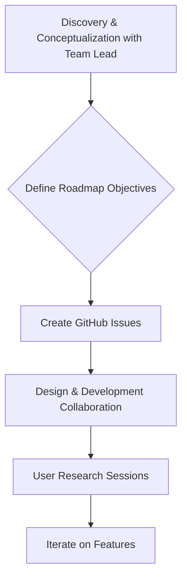

## Thesis
At Automattic (Jetpack), product designers often own discovery and prioritization themselves — design absorbs classic PM duties under high autonomy.

## Context
Automattic is the company behind WordPress, powering a significant portion of the world's websites. The company is distributed globally, with approximately 2,000 employees organized into product-specific teams. The interviewee works on the newsletters product, which competes with platforms like Substack but offers greater extensibility through the WordPress ecosystem.

## Operating loop

## Ownership
*   **Discovery:** Primarily owned by the Product Designer, with significant input from the team lead.
*   **Prioritization:** Influenced by business-side roadmaps and team leads, with product leads having a guiding role.
*   **Shipping:** Teams work on their respective roadmaps, with a philosophy of releasing features that are incrementally better than existing solutions.
*   **Sales Input:** Not explicitly mentioned.
*   **Design:** Owned by the Product Designer, with close collaboration with the development team.

## Evidence
*   *The philosophy is that each team works as best it can; there's no philosophy of imposing a structure like we're going to work with Ship Up, we're going to work with Scrum.*
*   *I probably do more of the Discovery part because I conceptualize a lot with Mikael, who is the lead of Zap, about the current state of the functionalities we have.*

## Gaps
*   The specific process for how the overall company roadmap is decided and communicated to individual teams is not detailed.
*   The extent of collaboration with sales or customer success teams for product input is not clarified.
*   Details on how cross-team dependencies or larger strategic initiatives are managed are absent.

## Listen

- YouTube: [El rol del PRODUCT DESIGNER con Cris Busquets, Senior Product Designer en Automattic](https://www.youtube.com/watch?v=wLA8F22fkZw)
- Audio: [episode audio](https://anchor.fm/s/ddca5200/podcast/play/87328677/https%3A%2F%2Fd3ctxlq1ktw2nl.cloudfront.net%2Fstaging%2F2024-4-28%2F379052680-44100-2-4fc66a8fc52e1.mp3)
- Show: [Entrevistas a Product Leaders](https://podcasters.spotify.com/pod/show/danidiestre)
- Host: [Dani Diestre](https://www.youtube.com/@DaniDiestre)

_Unofficial community note. Episode © host / guests. See [docs/LEGAL.md](../docs/LEGAL.md)._
