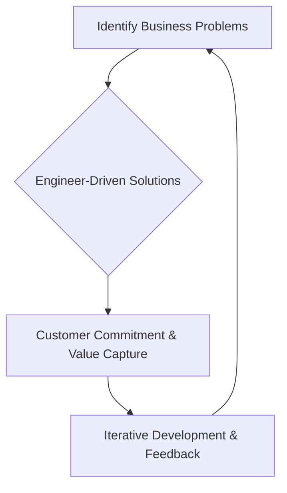

## Thesis
Episode is mostly Factorial product-org philosophy via Itnig co-founder — Factorial already has a published card; hold Itnig off the map.

## Context
Factorial offers an operating system for small businesses, aiming to eliminate bureaucracy and automate processes. The company has recently undergone a restructuring within its product team.

## Operating loop

## Ownership
*   **Discovery:** Product Managers are expected to deeply understand customer problems and connect with the go-to-market team.
*   **Prioritization:** Hypotheses are generated based on observed, tangible realities and pipeline data.
*   **Shipping:** Engineers and designers are encouraged to take ownership and contribute directly to business solutions.
*   **Sales Input:** Product Managers must establish strong links with sales and go-to-market teams.
*   **Design:** While not explicitly detailed, the emphasis on engineers taking ownership suggests a more integrated design approach within product teams.

## Evidence
*   *I believe much more that engineers who can solve problems, I want them to take this ownership.*
*   *The role of the PM should be focused slightly more on go-to-market, connecting with the rest of the company.*

## Gaps
*   The specific metrics used to evaluate product success beyond adoption and usage are not detailed.
*   The long-term vision for the product organization's structure and team topology beyond the current shift is not elaborated upon.
*   Details on how cross-functional collaboration is managed, particularly between product and other departments like sales and engineering, could be further clarified.

## Listen

- YouTube: [El rol del Product Manager con Bernat Farrero, Co-fundador de Itnig](https://www.youtube.com/watch?v=KyasUly8KpI)
- Audio: [episode audio](https://anchor.fm/s/ddca5200/podcast/play/76309048/https%3A%2F%2Fd3ctxlq1ktw2nl.cloudfront.net%2Fstaging%2F2023-8-24%2F348313678-44100-2-8667d0533c37.mp3)
- Show: [Entrevistas a Product Leaders](https://podcasters.spotify.com/pod/show/danidiestre)
- Host: [Dani Diestre](https://www.youtube.com/@DaniDiestre)

_Unofficial community note. Episode © host / guests. See [docs/LEGAL.md](../docs/LEGAL.md)._
