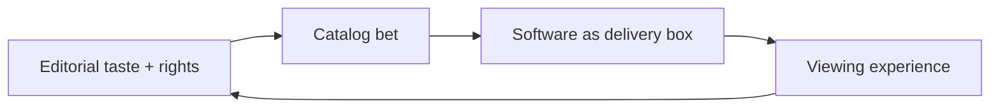

## Thesis
Filmin runs product as a cinema curation house first — catalog taste and creator relationships lead; software is the black box that serves that editorial bet, not the other way around.

## Context
Spanish streaming service (~17 years) competing with Netflix/Prime on curated cinema (arthouse, niche catalogs) rather than volume of originals.

## Operating loop

- Leadership’s film literacy sets what gets acquired and surfaced.
- Product ships the platform (apps, TV clients) around that catalog — recently internalized TV app work.
- Metrics matter less than whether the catalog still feels like “Filmin cinema.”

## Ownership
- **Discovery / prioritization:** editorial + CPO taste; product is secondary to content identity.
- **Shipping:** product/eng own the black-box apps that must not break the cinema experience.
- **Sales-led roadmap:** weak — retention is catalog identity, not growth hacks.

## Evidence
- *The product is very secondary for me. This is the point.*
- *Filming is a bit of an anomaly because in the race, let's call it the streaming race.*

## Gaps
- How creators get integrated into the product surface (still emerging).
- AI use beyond ops efficiencies not detailed.
- Competitive response to big-platform originals not fully mapped.

## Listen

- YouTube: ["El Software es una CAJA NEGRA" con Iñigo Medina, CPO de Filmin (Parte 1)](https://www.youtube.com/watch?v=iMNLrbhi4cw)
- Audio: [episode audio](https://anchor.fm/s/ddca5200/podcast/play/92028699/https%3A%2F%2Fd3ctxlq1ktw2nl.cloudfront.net%2Fstaging%2F2024-8-22%2F386800967-44100-2-48457f80f6f93.mp3)
- Show: [Entrevistas a Product Leaders](https://podcasters.spotify.com/pod/show/danidiestre)
- Host: [Dani Diestre](https://www.youtube.com/@DaniDiestre)

_Unofficial community note. Episode © host / guests. See [docs/LEGAL.md](../docs/LEGAL.md)._
