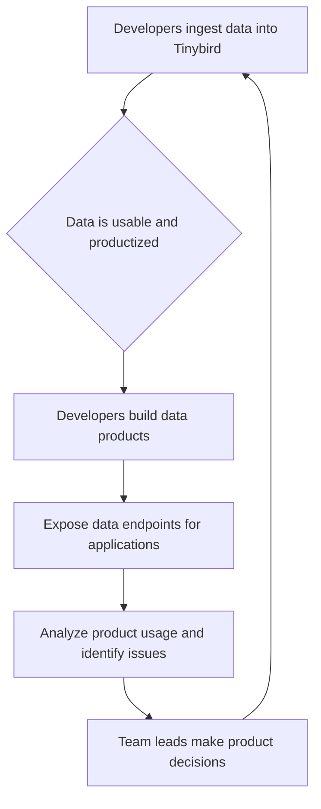

## Thesis
Tinybird deleted the PM layer so technical leads own product decisions for a developer audience that rejects classic PM mediation.

## Context
Tinybird offers a data platform designed for developers, enabling them to build data products. The company targets businesses with significant data volumes, ranging from those processing 20 million records to trillions daily. They are transitioning from focusing on large enterprise clients to a broader market of smaller customers.

## Operating loop

## Ownership
*   **Discovery:** Team leads within product teams.
*   **Prioritization:** Team leads within product teams.
*   **Shipping:** Team leads within product teams (with full engineering responsibility).
*   **Sales Input:** Unknown.
*   **Design:** Unknown.

## Evidence
*   *We eliminated the product team to be all product.*
*   *The interesting part of Tinybird is that it's not a tool to just analyze data; it's a tool where data analysis is productized.*

## Gaps
*   The specific process for how sales input influences product decisions is not detailed.
*   The interview does not elaborate on the design ownership or process within the teams.
*   Details on how customer feedback from larger, long-term clients is integrated into the product roadmap are not fully explained.

## Listen

- YouTube: [Eliminamos al equipo de Producto para ser todos Producto | Javi Santana, Co Founder de Tinybird](https://www.youtube.com/watch?v=qMEVsemCo5c)
- Audio: [episode audio](https://anchor.fm/s/ddca5200/podcast/play/95934290/https%3A%2F%2Fd3ctxlq1ktw2nl.cloudfront.net%2Fstaging%2F2024-11-17%2F391686884-44100-2-5f2ad0afd1313.mp3)
- Show: [Entrevistas a Product Leaders](https://podcasters.spotify.com/pod/show/danidiestre)
- Host: [Dani Diestre](https://www.youtube.com/@DaniDiestre)

_Unofficial community note. Episode © host / guests. See [docs/LEGAL.md](../docs/LEGAL.md)._
