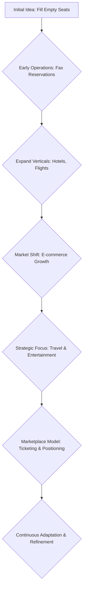

## Thesis
Atrápalo stayed a multi-vertical leisure marketplace — tickets, travel, restaurants — by chasing demand signals instead of locking into one niche (they literally started selling tickets by fax).

## Context
Atrápalo, founded in 2000, is a Spanish online travel and entertainment marketplace. It began by filling empty seats in theaters and hotels before expanding into flights and other leisure activities, navigating the early days of e-commerce without established players like Google or Booking.com.

## Operating loop

## Ownership
*   **Discovery:** Supported by user demand and market signals, with a willingness to pivot and focus.
*   **Prioritization:** Driven by identifying verticals with empty capacity and adapting to evolving e-commerce capabilities.
*   **Shipping:** Evolved from manual processes to integrated ticketing systems and marketplace features.
*   **Sales-input:** Integrated through user feedback and observing market trends, leading to expansion into new verticals.
*   **Design:** Focused on creating a good user experience, initially by removing payment friction and later by developing robust ticketing and marketplace platforms.

## Evidence
*   *Initially, it wasn't ticketing; it was reservation lists that we passed physically with a fax.*
*   *We were one of the pioneers in offering a service via the internet.*

## Gaps
*   The specific metrics and algorithms used for organic search ranking and paid positioning are not detailed.
*   The company's approach to AI and LLMs for future product development is still in exploratory stages.
*   Details on the internal structure and specific roles within the data and growth teams are limited.

## Listen

- YouTube: ["Empezamos vendiendo ENTRADAS por FAX" | Manuel Roca, CEO y Cofounder de Atrápalo](https://www.youtube.com/watch?v=svhwRR8y1zA)
- Audio: [episode audio](https://anchor.fm/s/ddca5200/podcast/play/85517027/https%3A%2F%2Fd3ctxlq1ktw2nl.cloudfront.net%2Fstaging%2F2024-3-16%2F374568972-44100-2-31cd528d8cbaa.mp3)
- Show: [Entrevistas a Product Leaders](https://podcasters.spotify.com/pod/show/danidiestre)
- Host: [Dani Diestre](https://www.youtube.com/@DaniDiestre)

_Unofficial community note. Episode © host / guests. See [docs/LEGAL.md](../docs/LEGAL.md)._
