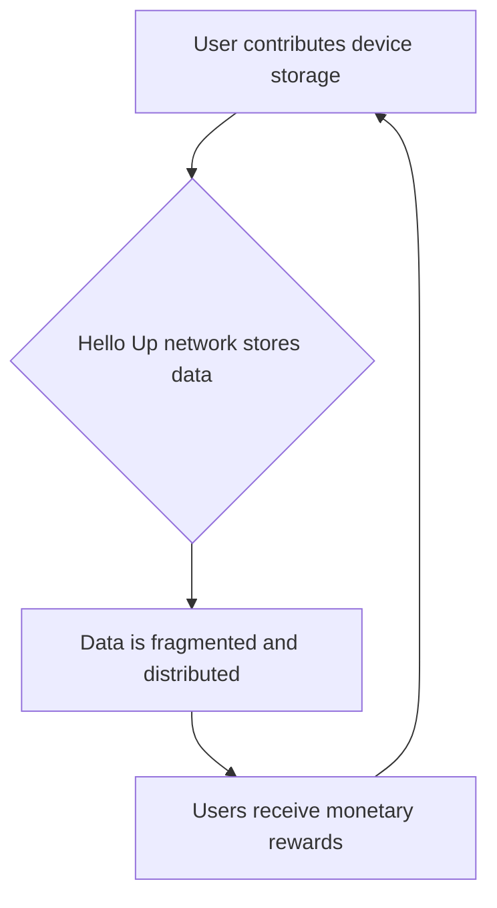

## Thesis
hello.app monetizes idle device storage into a decentralized network — users earn by contributing unused capacity instead of renting centralized cloud.

## Context
Hello Up is a startup developing a decentralized storage solution. The company's product aims to offer an alternative to centralized cloud storage providers by utilizing a distributed network of user devices. The company is targeting both Web2 users seeking cost-effective storage and Web3 users prioritizing privacy and decentralization.

## Operating loop

## Ownership
- Discovery: Primarily driven by the founder, with input from the product designer and the open-source community.
- Prioritization: Led by the founder, who acts as the product manager, with input from the CTO and community.
- Shipping: Managed by the founder, coordinating with the CTO and the open-source contributors.
- Sales Input: Primarily from the founder, with early traction from Web3 businesses.
- Design: Co-led by the founder and the product designer.

## Evidence
*The company's core innovation lies in creating the first decentralized storage network based on mobile devices worldwide.*
*We are here not to be another startup, but to be the next Spanish unicorn.*

## Gaps
- The long-term technical feasibility and scalability of relying on diverse user devices for a robust storage network are not fully detailed.
- Specific strategies for educating and onboarding mainstream Web2 users to a decentralized storage model are still developing.
- The exact mechanisms and sustainability of the monetary reward system for storage contributors require further clarification.

## Listen

- YouTube: [Fundar una Startup con 16 años con Alvaro Pintado, Fundador de hello.app](https://www.youtube.com/watch?v=WiN6P2E8jbY)
- Audio: [episode audio](https://anchor.fm/s/ddca5200/podcast/play/77346377/https%3A%2F%2Fd3ctxlq1ktw2nl.cloudfront.net%2Fstaging%2F2023-9-17%2F351560629-44100-2-4775bc18a560f.mp3)
- Show: [Entrevistas a Product Leaders](https://podcasters.spotify.com/pod/show/danidiestre)
- Host: [Dani Diestre](https://www.youtube.com/@DaniDiestre)

_Unofficial community note. Episode © host / guests. See [docs/LEGAL.md](../docs/LEGAL.md)._
