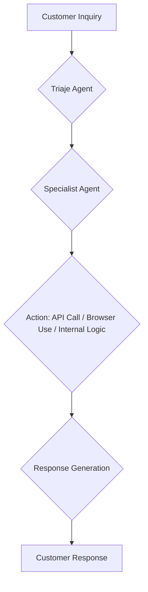

## Thesis
Gurusup differentiates itself by building an AI agent system capable of performing actions and end-to-end customer support, rather than just suggesting responses based on historical data.

## Context
Gurusup is a Spanish company developing an AI-powered customer support platform. The company, founded by Victor Mollá, aims to automate customer service by enabling AI agents to interact with systems like CRMs and dashboards, and perform actions directly.

## Operating loop

## Ownership
- **Discovery:** Primarily driven by internal problems faced by the company and its founder's extensive experience with AI and customer support challenges.
- **Prioritization:** Focused on solving real customer problems with AI, aiming for broad applicability across SMEs rather than vertical specialization.
- **Shipping:** Rapid iteration and deployment, leveraging a small codebase and a willingness to pivot quickly based on market feedback and technological advancements.
- **Sales-input:** While not explicitly detailed, the product's development is informed by the challenges of customer onboarding and reducing friction in product adoption.
- **Design:** The product's design is heavily influenced by the capabilities of AI, aiming to reduce reliance on traditional UIs and dashboards in favor of conversational interfaces.

## Evidence
- *We are a system of agents that are capable of performing actions and that is when my mind opened and we saw that we could truly do end to end.*
- *Our competitors announce that they can answer 50% of tickets well. We can answer 100% well.*

## Gaps
- The specific metrics used to measure agent performance beyond similarity and accuracy are not fully detailed.
- The long-term strategy for scaling the business and potential future pricing models beyond per-response costs are not elaborated upon.
- Details on how they handle the "cold start" problem for new clients and pre-configure agents are mentioned but not fully demonstrated.

## Listen

- YouTube: ["Gestionamos 500.000 Tickets con Agentes de IA" | Product Demo de GuruSup con Victor Mollá](https://www.youtube.com/watch?v=pEj3I-sZhs4)
- Audio: [episode audio](https://anchor.fm/s/ddca5200/podcast/play/101960180/https%3A%2F%2Fd3ctxlq1ktw2nl.cloudfront.net%2Fstaging%2F2025-3-29%2F399314531-44100-2-515826d88411f.mp3)
- Show: [Entrevistas a Product Leaders](https://podcasters.spotify.com/pod/show/danidiestre)
- Host: [Dani Diestre](https://www.youtube.com/@DaniDiestre)

_Unofficial community note. Episode © host / guests. See [docs/LEGAL.md](../docs/LEGAL.md)._
