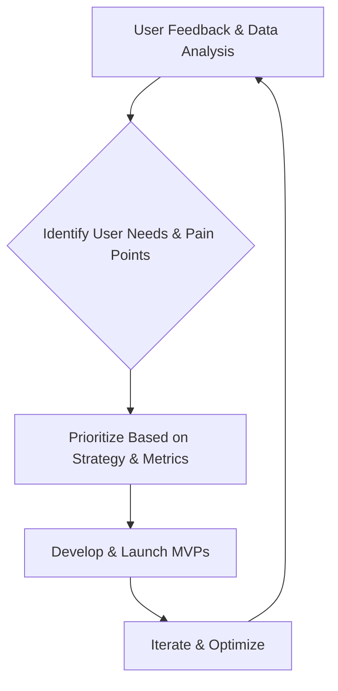

## Thesis
HubSpot mobile ships marketer journeys as fast MVPs — product adapts AI into on-the-go CRM workflows rather than waiting for perfect desktop parity.

## Context
Hubspot offers a comprehensive CRM and marketing platform. Sara Guiral works on the mobile marketing hub, focusing on enabling marketers to perform key tasks remotely.

## Operating loop

## Ownership
*   **Discovery:** Product Manager (Sara Guiral) and Product Designer collaborate on user interviews and data analysis.
*   **Prioritization:** Teams decide their own prioritization methods, influenced by company strategy, OKRs, and user feedback.
*   **Shipping:** Global releases, with betas for high-risk features or undefined pricing.
*   **Sales Input:** Collaboration with Customer Support and Sales teams to gather feedback and understand user blockers.
*   **Design:** Product Designer (Ela) is a key partner, involved from discovery through to solutioning, with the final say on design.

## Evidence
*   *My mission is to enable the marketer on the go.*
*   *I prefer that a user complains rather than says nothing.*

## Gaps
The interview does not detail specific AI use cases currently in development or the exact metrics used to measure the impact of mobile features on revenue. The precise structure of Hubspot's OKR system and how it cascades down to individual teams is also not fully elaborated.

## Listen

- YouTube: ["La AI se va a quedar" con Sara Guiral, Senior PM en Hubspot](https://www.youtube.com/watch?v=5P9MfStTCOo)
- Audio: [episode audio](https://anchor.fm/s/ddca5200/podcast/play/79001598/https%3A%2F%2Fd3ctxlq1ktw2nl.cloudfront.net%2Fstaging%2F2023-10-22%2F356752331-44100-2-78fb29b7e0c96.mp3)
- Show: [Entrevistas a Product Leaders](https://podcasters.spotify.com/pod/show/danidiestre)
- Host: [Dani Diestre](https://www.youtube.com/@DaniDiestre)

_Unofficial community note. Episode © host / guests. See [docs/LEGAL.md](../docs/LEGAL.md)._
