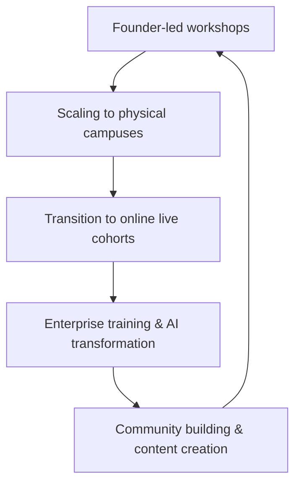

## Thesis
Product School scaled from founder bootcamps to enterprise AI training via live cohort learning and B2B partnerships — community is the distribution engine.

## Context
Product School, founded by Carlos González, is a global organization offering training and community for product managers and other tech professionals. It has evolved from in-person workshops to a primarily online, live-instruction model, and now focuses significantly on enterprise-level AI transformation services.

## Operating loop

## Ownership
*   **Discovery:** Founder-led initially, then through a dedicated routing team for speakers and instructors. Community feedback and enterprise client needs also drive discovery.
*   **Prioritization:** Driven by market demand, particularly the shift towards AI transformation and enterprise needs.
*   **Shipping:** Evolved from founder-led instruction to a scalable model with contracted instructors and a dedicated enterprise sales team.
*   **Sales Input:** Primarily from enterprise clients and the growth of the B2C consumer business.
*   **Design:** Initially handled by the founder, now likely by a product team focused on curriculum and platform development.

## Evidence
*   *The business B2B eats more than 70 percent of B2C now.*
*   *Our vision is now beyond product, to become the world leader in helping companies in their artificial intelligence transformation.*

## Gaps
*   Specific details on the current team structure and size are not provided.
*   The exact methodology for assessing and customizing enterprise AI transformation plans is not elaborated upon.
*   Future plans for expanding into non-English speaking markets beyond current offerings are not detailed.

## Listen

- YouTube: [La mayor comunidad de Product Managers, Carlos González de Villaumbrosia Founder en Product School](https://www.youtube.com/watch?v=th22yAbrhFA)
- Audio: [episode audio](https://anchor.fm/s/ddca5200/podcast/play/83335699/https%3A%2F%2Fd3ctxlq1ktw2nl.cloudfront.net%2Fstaging%2F2024-1-28%2F369149245-44100-2-6c40caef2610d.mp3)
- Show: [Entrevistas a Product Leaders](https://podcasters.spotify.com/pod/show/danidiestre)
- Host: [Dani Diestre](https://www.youtube.com/@DaniDiestre)

_Unofficial community note. Episode © host / guests. See [docs/LEGAL.md](../docs/LEGAL.md)._
